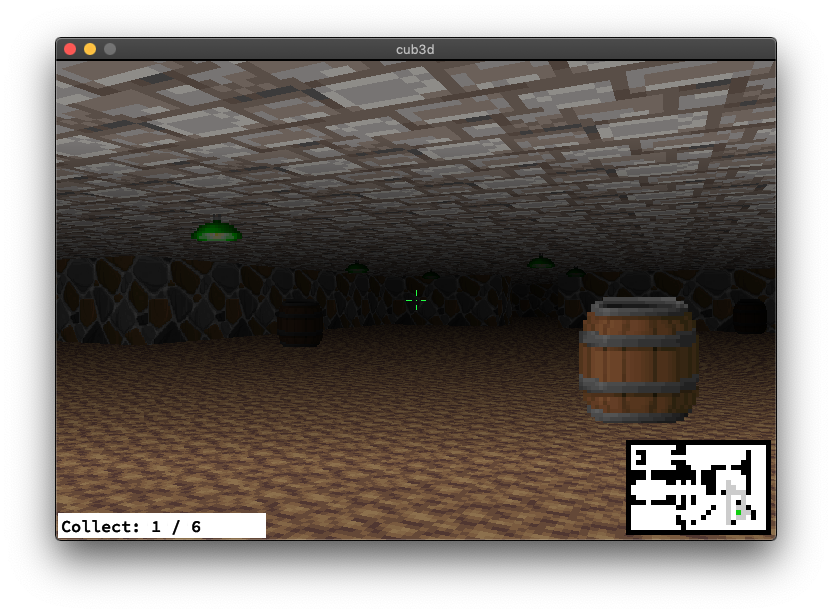

# cub3D

*本プロジェクトは、42 カリキュラムの一環として samatsum によって作成されました。*



## 概要 (Description)

cub3D は、C 言語と MiniLibX（X11）を用いて構築された、レイキャスティング（DDA 法）ベースの一人称 3D レンダリングエンジンです。`Wolfenstein 3D` 系の擬似 3D 表現に、武器切り替え・収集アイテム・扉・**巡回／追跡する敵 AI** といったゲーム要素を追加しています。さらに、同じエンジン上で動く対戦的な遊びとして **RSP モード（じゃんけん鬼ごっこ）** を備えています。

### 2 つのモード

- **FPS モード**: `./cub3D maps/fps_map/<map.cub>` — 敵を避け／倒し、収集アイテムを集めて扉を開く一人称探索。
- **RSP モード**: `./cub3D maps/rsp_map/<map.cub>` — プレイヤー（赤チーム）と NPC が赤・青に分かれ、接触時の **じゃんけん** で勝敗を決める鬼ごっこ。負けた側は即リスポーン。

モードはマップの配置ディレクトリで自動判定されます。第 2 引数は指定しません。

主な機能:

- DDA レイキャスティングによる壁描画、距離に応じた陰影（シェード）
- テクスチャ付きの床・天井（未指定時は単色フォールバック）
- 距離ソート付きのスプライト描画（障害物・装飾・収集アイテム・敵）
- **オブジェクトは 3 カテゴリ × 最大 5 種**（通行不可 / 通行可 / 収集）まで個別テクスチャを割り当て可能
- 8 方向スプライトで描画される敵 AI。**巡回路（`P`）を右手法則で周回し、正面視野＋視線判定でプレイヤーを検知すると追跡**（HP・追跡タイマー付き）
- **収集アイテムをすべて集めると開く扉**（マップ文字 `D`）
- FPS モード専用の武器切り替え（ピストル / フラッシュライト / 素手）と射撃
- ミニマップ・収集進捗・クロスヘアの ON/OFF
- **移動速度・回転速度・FOV・敵の追跡秒数・敵の移動速度・敵の HP を `.cub` から実行時に調整可能**
- **RSP モード（じゃんけん鬼ごっこ）**: チーム制。手は接触時に自動でじゃんけん判定され、自陣スポーンを踏むと手が変わる

### アーキテクチャ概略

```
                        [ User Input (X11 keyboard) ]
                                    │
                                    ▼
┌───────────────────────────────────────────────────────────────────┐
│                            Main Loop (mlx)                         │
│                                                                    │
│   Input (WASD/Arrows)  ─► Camera/World update ─► Renderer          │
│       │                          │                   │             │
│       ▼                          ▼                   ▼             │
│   t_input        t_camera / t_world (敵AI含む)  t_render (screen)  │
│                                                                    │
└───────────────────────────────────────────────┬────────────────────┘
                                                 │
                                                 ▼
                                    Window (X11) via MiniLibX
```

FPS モードの敵 AI は毎フレーム「索敵 → 巡回 or 追跡 → 移動」を実行します。RSP モードでは敵 AI が「最寄りの異チーム戦闘員を見て、勝てる手なら追跡・負ける手なら逃走・あいこは徘徊」に切り替わります。詳細は [DEV_DOC.md](./md_files/cub3d/DEV_DOC.md) §3（FPS）／§4（RSP）を参照してください。

## 動作要件

- Linux（X11）
- `gcc`, `make`
- 開発ヘッダ: `xorg`, `libxext-dev`, `libbsd-dev`

Debian/Ubuntu 系での導入例:

```
sudo apt-get install gcc make xorg libxext-dev libbsd-dev
```

## ビルドと実行

```
make
./cub3D maps/fps_map/1.cub      # FPS モード
./cub3D maps/rsp_map/rsp.cub    # RSP モード（じゃんけん鬼ごっこ）
```

ビルドは `-O2 -Wall -Wextra -Werror`（インクルードパスは `codes/includes`）で行われます。`make debug`（AddressSanitizer 付き）・`make check`（失敗すべき lint ゲート）・`make audit`（助言系を含む全 lint）・`make clean` / `make fclean` / `make re` も利用できます。

## 操作 (Controls)

| 入力 | 動作 |
|---|---|
| `W` / `S` | 前進 / 後退 |
| `A` / `D` | 左右に平行移動（ストレイフ） |
| `←` / `→` | 視点を左右に回転 |
| `1` / `2` / `3` | 武器切り替え（ピストル / フラッシュライト / 素手、**FPS モード専用**） |
| `Space` | 射撃（ピストル装備時のみ、クールダウンあり。**FPS モード専用**） |
| `I` | UI（ミニマップ・進捗表示）の表示切替 |
| `O` | クロスヘア（照準）の表示切替 |
| `L` | 距離に応じた影付きシェーディングの切替 |
| `Esc` または ウィンドウの × | 終了 |

> **注:** 移動は WASD、回転は左右矢印のみです（上下矢印・Q・E は未割り当て）。**RSP モードでは `1` / `2` / `3` / `Space` は無効** で、武器切り替え・射撃はできません。じゃんけんは戦闘員どうしの接触時に自動で判定されます。

## マップ仕様

cub3D は `.cub` ファイルで解像度・テクスチャ・色・各種パラメータ・マップ本体を記述します。FPS 用マップは `maps/fps_map/`、RSP 用マップは `maps/rsp_map/` に置き、配置ディレクトリでモードを判定します。オブジェクトは 3 カテゴリ × 最大 5 種まで個別テクスチャを指定でき、移動速度・敵パラメータなどは `.cub` から上書きできます。主なマップ文字は `M`（敵の出現地点）・`P`（敵が周回する巡回路）・`D`（収集完了で開く扉）・`N/S/E/W`（プレイヤー初期位置と向き）です。RSP モードでは `N/W`（赤チーム）と `S/E`（青チーム）のスポーンを **各チーム 2 地点以上** 用意します。詳しい記述ルールは [USER_DOC.md](./md_files/cub3d/USER_DOC.md) を参照してください。

## ドキュメント

- 👉 **[USER_DOC.md](./md_files/cub3d/USER_DOC.md)** — プレイヤー／評価者向け。起動方法、操作、RSP モードの遊び方、`.cub` の記述ルール（敵・巡回路・扉・各種パラメータを含む）。
- 👉 **[DEV_DOC.md](./md_files/cub3d/DEV_DOC.md)** — 開発者向け。モジュール構造（common / fps / rsp の 3 系統）、敵 AI と RSP AI の詳細、データフロー、チューニング値、結果スクリーンショット、付属の lint ツール。
- 👉 **[CODING_RULES.md](./md_files/cub3d/CODING_RULES.md)** — C コーディングルールの正本。`make check` の `CRxxx` 表示はここに対応。

## 参考資料 (Resources)

- [Lode's Computer Graphics Tutorial — Raycasting](https://lodev.org/cgtutor/raycasting.html)
- [A first-person engine in 265 lines (PlayfulJS)](http://www.playfuljs.com/a-first-person-engine-in-265-lines/)
- [42Paris / minilibx-linux](https://github.com/42Paris/minilibx-linux)
- [BMP format reference](https://stackoverflow.com/questions/2654480/writing-bmp-image-in-pure-c-c-without-other-libraries)
