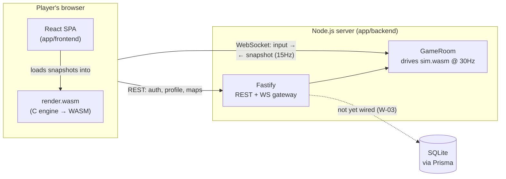

# ft_transcendence

*This project has been created as part of the 42 curriculum by samatsum, torinoue, mamiyaza, hminemur.*


A browser-based online multiplayer game platform, built by evolving a 42 `cub3D` engine (C,
raycasting, MiniLibX) directly into a real-time web application: the same C game logic runs
natively, compiled to WASM in the browser for rendering, and compiled to WASM on the server as the
sole authority over the match. Two game modes ship on top of it — an RSP ("rock-paper-scissors
tag") team battle and an FPS collect-and-race mode.

## Current status (2026-08-07)

The C engine is complete. The online product layer around it — auth, matchmaking, and most of the
frontend — is partially built. Read this table before trying to demo anything:

| Area | Status |
|---|---|
| **Engine** (`codes/` + `web/`) — rendering, physics, both game modes, AI, server-authoritative sim | ✅ **Complete** |
| **Server** (`app/backend/`) — lobby WS, matchmaking, GameRoom driving `sim.wasm`, disconnect/reconnect, map whitelist | ✅ **Core complete** (W-01, W-08 core, W-09–W-12, W-14). Blocked on real Cookie auth (W-04/W-05) for final integration; persistence (W-13), Docker/nginx delivery (W-15), and CI extension (W-16) not started |
| **Auth / DB / friends / avatar** (`app/backend/`) | ❌ **Not started** (W-02–W-07). A dev-only header-based auth stub (`ALLOW_DEV_AUTH`) stands in for it |
| **Frontend** (`app/frontend/`) — scaffold, API client, GameView, HUD | ✅ Scaffold, fetch layer, GameView, and HUD are done (F-01, F-02, F-06, F-07) |
| **Frontend — lobby, auth screens, match transition, profile** | ❌ **Not started** (F-03–F-05, F-08–F-12). The lobby route is currently a stub with a dev-only link straight into a match |
| **End-to-end result**: log in → find a match → play → see results | ❌ **Not yet possible.** There is no lobby to matchmake from and no real login |

What *is* demoable today: the native/browser engine standalone (single player, both modes), and a
server-authoritative match rendered in the browser via a recorded/replayed snapshot stream (see
Demo B below) — the same wiring that a real WebSocket connection will use once the lobby exists.

Full per-issue detail: [`docs/ai/backlog.md`](./docs/ai/backlog.md) (English). Current team
capacity and the reason online play isn't finished yet: [`docs/ja/チーム体制.html`](./docs/ja/チーム体制.html)
(Japanese).

## Team

ft_transcendence is a 4-person group project per the subject (Chapter II). **As of 2026-08-05 the
team has dissolved to a single active contributor; this is an open, unresolved gap against the
subject's 4–5 person requirement** (see [`docs/ja/チーム体制.html`](./docs/ja/チーム体制.html) for
the full writeup — it is not resolved by this README, only accurately reported here).

| Required role (subject II.1.1) | Current holder | Notes |
|---|---|---|
| Technical Lead / Architect | **samatsum** | Fixed — designed and built the engine (`codes/`, `web/`) |
| Project Manager / Scrum Master | **samatsum** (filling an open slot) | |
| Product Owner | **samatsum** (filling an open slot) | |
| Developer (everyone) | **samatsum** | All active development |

Historical contributors (per git history, no longer active as of 2026-08-05): **torinoue**
(backend foundation: auth/REST/DB groundwork), **mamiyaza** (frontend foundation planning),
**hminemur** (frontend game-screen planning). Their planned ownership is recorded in
[`docs/ai/architecture.md`](./docs/ai/architecture.md) §6 as a historical record, not a current
assignment.

## Architecture


```mermaid
flowchart LR
    subgraph client["Player's browser"]
        FE["React SPA<br/>(app/frontend)"]
        RW["render.wasm<br/>(C engine → WASM)"]
        FE -->|"loads snapshots into"| RW
    end
    subgraph server["Node.js server (app/backend)"]
        BE["Fastify<br/>REST + WS gateway"]
        GR["GameRoom<br/>drives sim.wasm @ 30Hz"]
        BE --> GR
    end
    DB[("SQLite<br/>via Prisma")]

    client -- "REST: auth, profile, maps" --> BE
    client -- "WebSocket: input →<br/>← snapshot (15Hz)" --> GR
    BE -.->|"not yet wired (W-03)"| DB
```

The server is the sole authority: `sim.wasm` computes the real match state at 30Hz, and the
browser only renders whatever snapshot it last received — there is no win/loss-determination code
on the client. See [`docs/ja/explanations/サーバ権威モデル.html`](./docs/ja/explanations/サーバ権威モデル.html)
(Japanese, with diagrams) or [`docs/ai/ws-protocol.md`](./docs/ai/ws-protocol.md) (English,
protocol-level) for the full explanation.

## Quickstart — what you can actually run today

### A. Engine, single player, in the browser

No local Emscripten install needed — it's built inside Docker.

```bash
HOST_UID=$(id -u) HOST_GID=$(id -g) docker compose up --build
```

First run takes ~10 minutes (image pull + build). Once `web/build/` has `render.js` / `sim.js`, open:

```text
http://localhost:8000/web/engine_demo.html                      # FPS mode (default)
http://localhost:8000/web/engine_demo.html?map=rsp_map/rsp.cub  # RSP mode
```

Click the canvas to capture the mouse/keyboard; `Esc` releases it. Controls: see
[Controls](#controls) below. Stop with `Ctrl-C`; `docker compose down` to clean up.

> `HOST_UID`/`HOST_GID` avoid root-owned generated files; the build works without them too.

### B. Server-authoritative match, replayed (the core design, without a live server)

This is the same `sim.wasm` → JSON → interpolate → `render.wasm` pipeline the real WebSocket path
uses — only the transport (file vs. socket) differs. Requires step A to have built once.

```bash
node web/sim_demo/record.mjs
```

This runs a full RSP 2v2 match through `sim.wasm` at 30Hz on Node and writes every state to
`web/sim_demo/snapshots.json`. Then open:

```text
http://localhost:8000/web/sim_demo/replay.html
```

**This is not a video.** The file holds only numbers (position, facing, hand, score); the browser
re-renders the 3D scene from those numbers every frame, interpolating between snapshots. **There is
no win/loss-determination code in the browser** — see [Architecture](#architecture).

### C. Engine, native (Linux/X11)

```bash
sudo apt-get install gcc make xorg libxext-dev libbsd-dev
make
./cub3D maps/fps_map/1.cub      # FPS mode
./cub3D maps/rsp_map/rsp.cub    # RSP mode
```

WSL needs WSLg or an X server.

### D. Engine acceptance tests

```bash
make test     # 85 sim acceptance checks (no X11 needed)
make check    # 13 C coding-rule lint checks
```

`make test` builds a headless native `sim` and checks scoring, FPS goal detection, enemy hazards,
and all 4 online-match maps. CI runs this on every PR.

### E. Web app dev servers (backend + frontend, without Docker)

```bash
npm install                # once, installs all 3 workspaces
npm run dev:backend        # Fastify on :3000
npm run dev:frontend       # Vite on :5173, proxies /api to :3000
```

Open `http://localhost:5173`. With `NODE_ENV=development` and `ALLOW_DEV_AUTH=true` set (see
`.env.example`), an `x-dev-user` header stands in for real auth, which doesn't exist yet (W-04).
There is no lobby yet, so `/lobby` is a stub with a dev-only link straight into `/game/dev-room`
for exercising the GameView/HUD.

### Generated files

`web/build/` (wasm), `web/assets/` (converted textures), and `web/sim_demo/snapshots.json` are all
`.gitignore`d — generate them locally with the steps above, they aren't in `git pull`.

## Controls

| Input | Action |
|---|---|
| `W` / `S` | Move forward / backward |
| `A` / `D` | Strafe left / right |
| `←` / `→` | Turn left / right |
| `1` / `2` / `3` | Switch weapon (pistol / flashlight / bare hands, **FPS only**) |
| `Space` | Fire (pistol only, has cooldown, **FPS only**) |
| `I` | Toggle UI (minimap, collection progress) |
| `O` | Toggle crosshair |
| `L` | Toggle distance shading |
| `Esc` / window close | Quit |

RSP mode disables `1`/`2`/`3`/`Space` — hand-to-hand contact is resolved automatically.

## Tech stack

| Layer | Choice | Why |
|---|---|---|
| Engine | C, MiniLibX (native only), Emscripten → WASM (`render.wasm` client / `sim.wasm` server) | Reuses the complete cub3D engine unmodified for both rendering and server-authoritative simulation — zero duplicated game logic |
| Frontend | React + Vite + TypeScript + Tailwind CSS | SPA is sufficient (no SSR module); React code-gen quality is strong; Tailwind satisfies the CSS-framework requirement |
| Backend | Fastify + TypeScript | Runs `sim.wasm` directly under Node; official WS plugin; lighter than Nest for this scope |
| Realtime | Raw WebSocket (`@fastify/websocket`) | Socket.IO's abstraction isn't needed |
| DB | SQLite + Prisma (not yet wired, W-03) | Single-host evaluation target; satisfies the ORM requirement |
| Auth | argon2id password hashing + opaque httpOnly session cookie (not JWT) (not yet wired, W-04) | Stateless JWT gives up server-side revocation for no benefit here |
| Delivery | nginx (TLS termination, static + WS proxy) + Docker Compose (not yet wired, W-15) | Single-command startup requirement |
| Shared contracts | zod schemas in `app/shared/` | One schema, validated on both frontend and backend |

Full rationale and trade-off comparisons: [`docs/ai/architecture.md`](./docs/ai/architecture.md).

## Documentation

This repo keeps two parallel documentation sets under `docs/`:

- **`docs/ai/`** — English Markdown, written for an AI coding assistant to consult. Detailed
  design docs, the full issue backlog, coding rules, and the git workflow this repo follows.
  Start at [`docs/ai/README.md`](./docs/ai/README.md).
- **`docs/ja/`** — Japanese HTML, written for samatsum. Onboarding, a lane-by-lane terminology
  glossary (`docs/ja/専門用語/`), and conceptual explanations of the engine/server design with
  diagrams. Start at [`docs/ja/index.html`](./docs/ja/index.html).

Specific pointers:

- 👉 [`docs/ja/プレイヤーガイド.html`](./docs/ja/プレイヤーガイド.html) — for players/evaluators:
  launch instructions, controls, RSP mode rules, `.cub` map format.
- 👉 [`docs/ai/dev-doc.md`](./docs/ai/dev-doc.md) — for developers: module structure, enemy/RSP
  AI internals, data flow, tuning values, lint tooling.
- 👉 [`docs/ai/coding-rules.md`](./docs/ai/coding-rules.md) — canonical C coding rules; every
  `CRxxx` code `make check` prints maps 1:1 to a rule here.

## Resources

- [Lode's Computer Graphics Tutorial — Raycasting](https://lodev.org/cgtutor/raycasting.html)
- [A first-person engine in 265 lines (PlayfulJS)](http://www.playfuljs.com/a-first-person-engine-in-265-lines/)
- [42Paris / minilibx-linux](https://github.com/42Paris/minilibx-linux)
- [BMP format reference](https://stackoverflow.com/questions/2654480/writing-bmp-image-in-pure-c-c-without-other-libraries)

**AI usage**: AI pair-programming (Claude Code) was used throughout — boilerplate (CRUD, UI
scaffolding, zod schemas, Emscripten build config, documentation) defaults to AI generation, while
design decisions for the sim/protocol/schema layers get human review. AI-authored commits and PRs
are visible directly in `git log` / the GitHub PR history.
