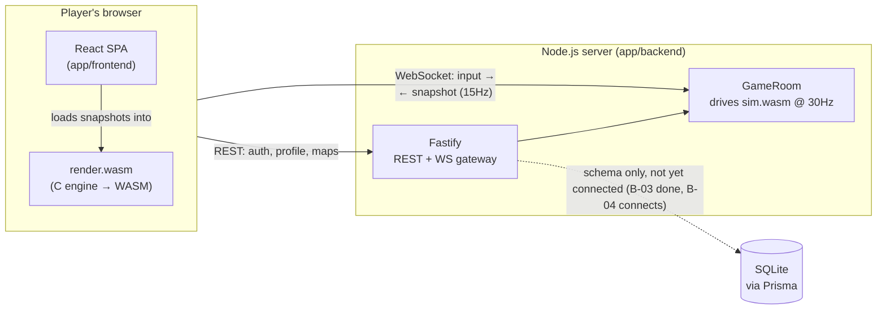

# ft_transcendence

*This project has been created as part of the 42 curriculum by samatsum, torinoue, ttsubo, kmitsuki,
kkurose, tomtomvx.*


A browser-based online multiplayer game platform, built by evolving a 42 `cub3D` engine (C,
raycasting, MiniLibX) directly into a real-time web application: the same C game logic runs
natively, compiled to WASM in the browser for rendering, and compiled to WASM on the server as the
sole authority over the match. Two game modes ship on top of it — an RSP ("rock-paper-scissors
tag") team battle and an FPS collect-and-race mode.

## Current status

Tracked live on GitHub, not here — this section used to be a manually-maintained status table, which
is exactly the kind of fact that goes stale (see [`docs/drafts/141-docs-restructure.md`](./docs/drafts/141-docs-restructure.md)
for why). Check:

- [Issues](https://github.com/samatsum/ft_Transcendence/issues) and the
  [Project board](https://github.com/users/samatsum/projects/1) for what's open/closed and in progress
- [`docs/ai/backlog.md`](./docs/ai/backlog.md) for acceptance criteria, dependencies, and the
  decision log (this file doesn't restate current % done, only *why* something was built the way it was)

Current team roster and roles: [`docs/human/はじめに/チーム体制.html`](./docs/human/はじめに/チーム体制.html)
(Japanese).

## Team

ft_transcendence is a 4–5-person group project per the subject (Chapter II). **As of 2026-08-30 the
team is 6 people** (up from a single active contributor through 2026-08-09), meeting the subject's
person-count requirement (see
[`docs/human/はじめに/チーム体制.html`](./docs/human/はじめに/チーム体制.html) for the full writeup).

| Required role (subject II.1.1) | Current holder | Notes |
|---|---|---|
| Technical Lead / Architect | **ttsubo** (GitHub: `cacapon`) | Designed and built the engine (`codes/`, `web/`); handed the TL role here 2026-08-30 |
| Project Manager / Scrum Master | **torinoue** (GitHub: `tototec1234`) | Rejoined 2026-08-28 under a new GitHub account after the earlier team dissolution |
| Product Owner | **kmitsuki** (GitHub: `mitsukio-o`) | |
| Developer | **kkurose** (GitHub: `kkur0z`), **tomtomvx** (GitHub: `tomtomvx`) | |
| Supporter | **samatsum** (GitHub: `samatsum`) | Stepped back from core membership 2026-08-30; previously sole TL/PM/PO/Developer through 2026-08-09 |

Historical contributors (per git history, no longer active): **mamiyaza** (frontend foundation
planning), **hminemur** (frontend game-screen planning). Their planned ownership is recorded in
[`docs/ai/architecture.md`](./docs/ai/architecture.md) §6 as a historical record, not a current
assignment.

## Architecture


```mermaid
flowchart LR
    subgraph client["Player's browser"]
        FE["React SPA<br/>(app/frontend)"]
        RW["render.wasm<br/>(C engine → WASM)"]
        FE -->|"loads snapshots into"| RW
    end
    subgraph server["Node.js server (app/backend)"]
        BE["Fastify<br/>REST + WS gateway"]
        GR["GameRoom<br/>drives sim.wasm @ 30Hz"]
        BE --> GR
    end
    DB[("SQLite<br/>via Prisma")]

    client -- "REST: auth, profile, maps" --> BE
    client -- "WebSocket: input →<br/>← snapshot (15Hz)" --> GR
    BE -.->|"schema only, not yet connected (B-03 done, B-04 connects)"| DB
```

The server is the sole authority: `sim.wasm` computes the real match state at 30Hz, and the
browser only renders whatever snapshot it last received — there is no win/loss-determination code
on the client. See [`docs/human/説明用/サーバ権威モデル.html`](./docs/human/説明用/サーバ権威モデル.html)
(Japanese, with diagrams) or [`docs/ai/ws-protocol.md`](./docs/ai/ws-protocol.md) (English,
protocol-level) for the full explanation.

## Quickstart — what you can actually run today

### A. Engine, single player, in the browser

No local Emscripten install needed — it's built inside Docker.

```bash
HOST_UID=$(id -u) HOST_GID=$(id -g) docker compose up --build
```

First run takes ~10 minutes (image pull + build). Once `web/build/` has `render.js` / `sim.js`, open:

```text
http://localhost:8000/web/engine_demo.html                      # FPS mode (default)
http://localhost:8000/web/engine_demo.html?map=rsp_map/rsp.cub  # RSP mode
```

Click the canvas to capture the mouse/keyboard; `Esc` releases it. Controls: see
[Controls](#controls) below. Stop with `Ctrl-C`; `docker compose down` to clean up.

> `HOST_UID`/`HOST_GID` avoid root-owned generated files; the build works without them too.

### B. Server-authoritative match, replayed (the core design, without a live server)

This is the same `sim.wasm` → JSON → interpolate → `render.wasm` pipeline the real WebSocket path
uses — only the transport (file vs. socket) differs. Requires step A to have built once.

```bash
node web/sim_demo/record.mjs
```

This runs a full RSP 2v2 match through `sim.wasm` at 30Hz on Node and writes every state to
`web/sim_demo/snapshots.json`. Then open:

```text
http://localhost:8000/web/sim_demo/replay.html
```

**This is not a video.** The file holds only numbers (position, facing, hand, score); the browser
re-renders the 3D scene from those numbers every frame, interpolating between snapshots. **There is
no win/loss-determination code in the browser** — see [Architecture](#architecture).

`node web/sim_demo/record.mjs fps` records an FPS 1vs1 the same way (writes
`web/sim_demo/snapshots_fps.json`; open `replay.html?feed=snapshots_fps.json`). Since FPS doesn't
finish deterministically from scripted wandering input, this recording runs a fixed 20s rather than
waiting for a decision — its purpose is watching the other seat render (G-12: on purpose
indistinguishable from a hazard, see the Engine row above), not seeing a full match.

### C. Engine, native (Linux/X11)

```bash
sudo apt-get install gcc make xorg libxext-dev libbsd-dev
make
./cub3D maps/fps_map/1.cub      # FPS mode
./cub3D maps/rsp_map/rsp.cub    # RSP mode
```

WSL needs WSLg or an X server.

### D. Engine acceptance tests

```bash
make test     # 96 sim acceptance checks (no X11 needed)
make check    # 13 C coding-rule lint checks
```

`make test` builds a headless native `sim` and checks scoring, FPS goal detection, enemy hazards,
and all 4 online-match maps. CI runs this on every PR.

### E. Web app dev servers (backend + frontend, without Docker)

```bash
npm install                # once, installs all 3 workspaces
npm run dev:backend        # Fastify on :3000
npm run dev:frontend       # Vite on :5173, proxies /api to :3000
```

Open `http://localhost:5173`. The auth screens and lobby are stubs, so there is not much to click
yet.

> **The `/game/dev-room` link on `/lobby` does not currently work from a browser**, despite what its
> label says. Two independent blockers, and they are waiting on *different* issues:
>
> 1. **The dev-auth stub cannot be satisfied from a browser** (blocked on **B-04**).
>    `authenticateRequest()` accepts an `x-dev-user` *header*, but the browser `WebSocket`
>    constructor cannot set request headers and the Vite proxy does not inject any — so the socket
>    closes with **4000 unauthenticated**. This one is hit first. Real cookie auth (B-04) removes it,
>    because a cookie *is* sent on the WS upgrade.
> 2. **No room is ever created** (blocked on **F-05 + B-09**, not B-04). `createRoom()` is called only
>    from `app/backend/src/game/dev-run.ts` and `app/backend/src/game/ws-check.ts`; the normally
>    started server (`app/backend/src/index.ts`) registers the WS route but creates nothing, so
>    `/ws/game/dev-room` closes with **4002 room-not-found**. Rooms are meant to come from lobby
>    matchmaking (F-05 drives B-08, B-09 turns a MatchPlan into a GameRoom) — fixing auth alone does
>    not make this route reachable.
>
> **What this means for GV-06 / GV-07's "done" status.** The code is written and merged, but be
> precise about what has actually been verified on the current `main`:
>
> | Layer | Verified by | Covers |
> |---|---|---|
> | Backend WS path | `app/backend/src/game/ws-check.ts` | B-11 / B-12 / B-14 only. Node `ws` clients — **it never loads the frontend, Canvas, or `render.wasm`** |
> | Interpolation + HUD logic | `snapshotInterp.test.ts`, `hudState.test.ts` | Pure functions, not rendering |
> | **GameView / HUD rendering in a browser** | **nothing** | — |
>
> **GV-06's acceptance criterion ("a match works between 2 browsers") is therefore not currently
> reproducible.** It was met manually while the dev route still worked; it cannot be re-run today.
> Re-establishing it needs real cookie auth (B-04) plus lobby-driven room creation (F-05 + B-09).
> Treat "GV-06 done" as "the integration code is merged", not as "the browser demo is passing".

### Generated files

`web/build/` (wasm), `web/assets/` (converted textures), and `web/sim_demo/snapshots.json` /
`snapshots_fps.json` are all `.gitignore`d — generate them locally with the steps above, they
aren't in `git pull`.

## Controls

| Input | Action |
|---|---|
| `W` / `S` | Move forward / backward |
| `A` / `D` | Strafe left / right |
| `←` / `→` | Turn left / right |
| `1` / `2` / `3` | Switch weapon (pistol / flashlight / bare hands, **FPS only**) |
| `Space` | Fire (pistol only, has cooldown, **FPS only**) |
| `I` | Toggle UI (minimap, collection progress) |
| `O` | Toggle crosshair |
| `L` | Toggle distance shading |
| `Esc` / window close | Quit |

RSP mode disables `1`/`2`/`3`/`Space` — hand-to-hand contact is resolved automatically.

## Tech stack

| Layer | Choice | Why |
|---|---|---|
| Engine | C, MiniLibX (native only), Emscripten → WASM (`render.wasm` client / `sim.wasm` server) | Reuses the complete cub3D engine for both rendering and server-authoritative simulation — zero duplicated game logic |
| Frontend | React + Vite + TypeScript + Tailwind CSS | SPA is sufficient (no SSR module); React code-gen quality is strong; Tailwind satisfies the CSS-framework requirement |
| Backend | Fastify + TypeScript | Runs `sim.wasm` directly under Node; official WS plugin; lighter than Nest for this scope |
| Realtime | Raw WebSocket (`@fastify/websocket`) | Socket.IO's abstraction isn't needed |
| DB | SQLite + Prisma (schema v1 created in B-03; the server does not connect yet — B-04 is the first consumer) | Single-host evaluation target; satisfies the ORM requirement |
| Auth | argon2id password hashing + opaque httpOnly session cookie (not JWT) (not yet wired, B-04) | Stateless JWT gives up server-side revocation for no benefit here |
| Delivery | nginx (TLS termination, static + WS proxy) + Docker Compose (not yet wired, I-15) | Single-command startup requirement |
| Shared contracts | zod schemas in `app/shared/` | One schema, validated on both frontend and backend |

Full rationale and trade-off comparisons: [`docs/ai/architecture.md`](./docs/ai/architecture.md).

## Documentation

This repo keeps two parallel documentation sets under `docs/`:

- **`docs/ai/`** — English Markdown, written for an AI coding assistant to consult. Detailed
  design docs, the full issue backlog, coding rules, and the git workflow this repo follows.
  Start at [`docs/ai/README.md`](./docs/ai/README.md).
- **`docs/human/`** — Japanese HTML, written for samatsum. Onboarding, a lane-by-lane terminology
  glossary (`docs/human/専門用語/`), and conceptual explanations of the engine/server design with
  diagrams. Start at [`docs/human/index.html`](./docs/human/index.html).

Specific pointers:

- 👉 [`docs/human/プレイヤー向け/プレイヤーガイド.html`](./docs/human/プレイヤー向け/プレイヤーガイド.html) — for players/evaluators:
  launch instructions, controls, RSP mode rules, `.cub` map format.
- 👉 [`docs/ai/dev-doc.md`](./docs/ai/dev-doc.md) — for developers: module structure, enemy/RSP
  AI internals, data flow, tuning values, lint tooling.
- 👉 [`docs/ai/coding-rules.md`](./docs/ai/coding-rules.md) — canonical C coding rules; every
  `CRxxx` code `make check` prints maps 1:1 to a rule here.

## Resources

- [Lode's Computer Graphics Tutorial — Raycasting](https://lodev.org/cgtutor/raycasting.html)
- [A first-person engine in 265 lines (PlayfulJS)](http://www.playfuljs.com/a-first-person-engine-in-265-lines/)
- [42Paris / minilibx-linux](https://github.com/42Paris/minilibx-linux)
- [BMP format reference](https://stackoverflow.com/questions/2654480/writing-bmp-image-in-pure-c-c-without-other-libraries)

**AI usage**: AI pair-programming (Claude Code) was used throughout — boilerplate (CRUD, UI
scaffolding, zod schemas, Emscripten build config, documentation) defaults to AI generation, while
design decisions for the sim/protocol/schema layers get human review. AI-authored commits and PRs
are visible directly in `git log` / the GitHub PR history.
