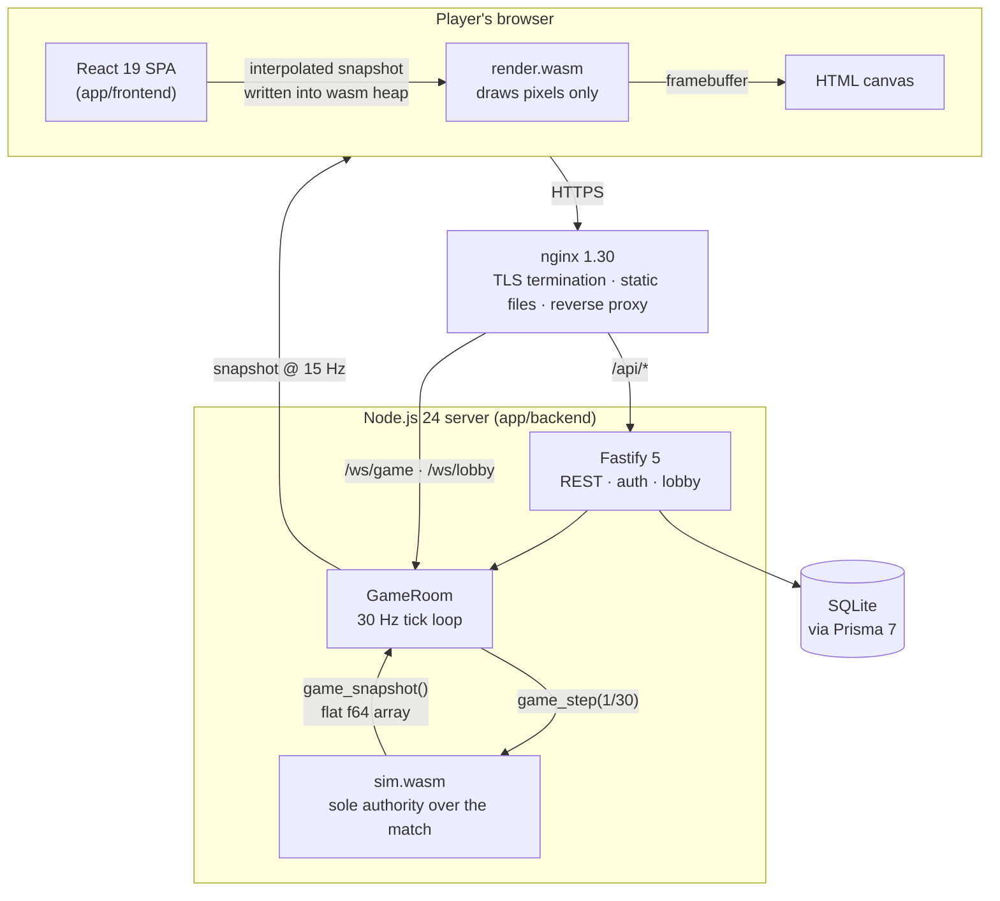
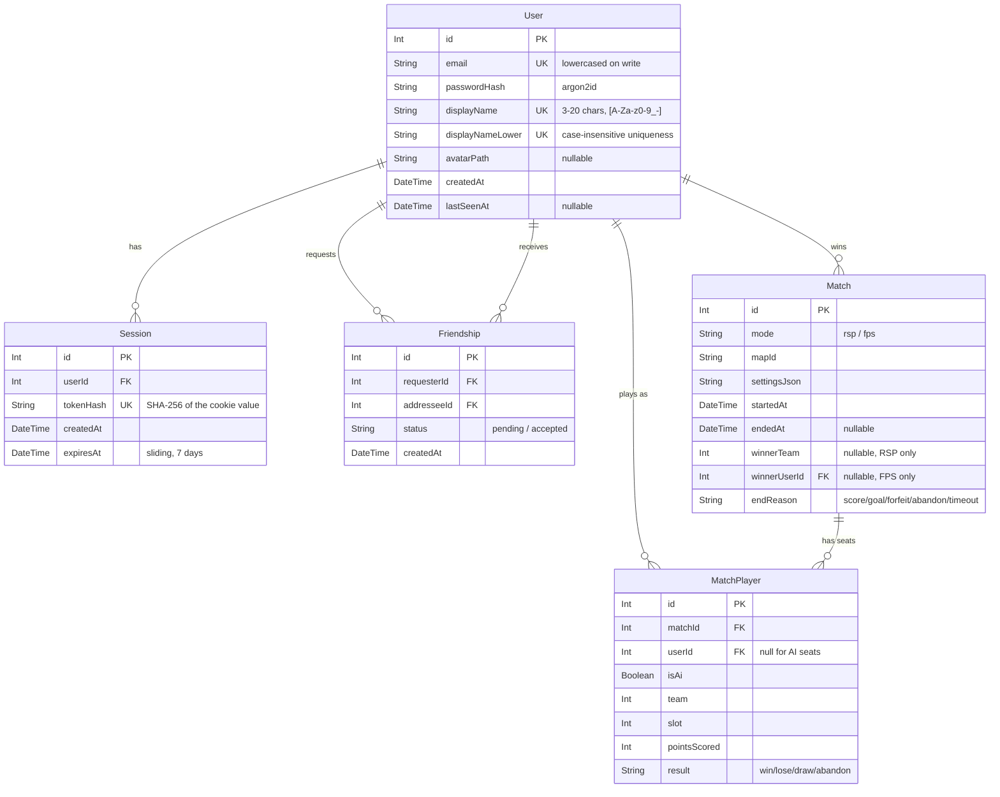

*This project has been created as part of the 42 curriculum by torinoue, ttsubo, kmitsuki, kkurose,
tvaroux.*

# ft_transcendence


A browser-based online multiplayer game platform, built by evolving a 42 `cub3D` engine (C,
raycasting, MiniLibX) directly into a real-time web application. **The same C source is compiled
three ways** — natively, to `render.wasm` for drawing in the browser, and to `sim.wasm` which runs
on the server as the sole authority over the match. There is no duplicated game logic and no
win/loss determination on the client.

Two game modes ship on top of it: **RSP**, a 4-player rock-paper-scissors team battle, and **FPS**,
a 1v1 collect-and-race mode.

---

## At a glance

| Topic | Section |
|---|---|
| Team members and roles | [2. Team and roles](#2-team-and-roles) |
| Project management approach | [3. How we worked](#3-how-we-worked) |
| Technologies used, with justifications | [5. Technologies and why](#5-technologies-and-why) |
| Database schema | [6. Database schema](#6-database-schema) |
| Modules and point calculation | [7. Modules and point calculation](#7-modules-and-point-calculation) |
| Features and who implemented them | [8. Features and who implemented them](#8-features-and-who-implemented-them) |
| Individual contributions | [9. Individual contributions](#9-individual-contributions) |
| Single-command deployment | [10. Running it](#10-running-it) |
| Password hashing / auth security | [5. Technologies and why](#5-technologies-and-why) → Auth row |
| Form validation (frontend + backend) | [5. Technologies and why](#5-technologies-and-why) → Shared contracts row |

**Declared module total: 14 points (mandatory) + 3 points (bonus).** See
[section 7](#7-modules-and-point-calculation) for the breakdown and the justification of each.

---

## 1. What this project is

### RSP mode — rock-paper-scissors tag (4 players, 2v2)

Four players are split into a red team and a blue team in a maze. Everyone holds rock, paper or
scissors, visible on screen. **Touching an opponent resolves the hand match automatically** — there
is no attack button. Winning scores a point and sends the loser back to their spawn; **you can only
change your hand by newly stepping onto your own team's spawn tile.** First team to the target
score wins.

### FPS mode — collect and race (1v1)

Ten collectibles are scattered through the maze. **The counter is shared between both players**, so
the pair must collect all ten before the gate door opens — then it becomes a race to the goal.
Pistols stun the opponent briefly, and map-placed hazards roam independently.

---

## 2. Team and roles

ft_transcendence is a 4–5-person group project per the subject (Chapter II). As of 2026-08-23 the
**5 submitted members** below meet the person-count requirement.

| Role (subject II.1.1) | Member | GitHub |
|---|---|---|
| Project Manager / Scrum Master | **torinoue** | `tototec1234` |
| Technical Lead / Architect | **ttsubo** | `cacapon` |
| Product Owner | **kmitsuki** | `mitsukio-o` |
| Developer | **kkurose** | `kkur0z` |
| Developer | **tvaroux** | `tomtomvx` |

### About the commit distribution

**`samatsum` is not one of the five submitted members.** They were the sole contributor from the
project's start through 2026-08-09, holding every role at once, and stepped back from core
membership on 2026-08-23. Their commits from that single-contributor period are why one non-member
account holds the largest share of the history. The five members above have worked on the project
since the team formed.

| Author | Commits (excluding merges) |
|---|---|
| samatsum *(not a submitted member)* | 198 |
| ttsubo / `cacapon` | 70 |
| kmitsuki / `mitsukio-o` | 19 |
| torinoue / `tototec1234` | 21 |
| kkurose / `kkur0z` | 17 |
| tvaroux / `tomtomvx` | 11 |

332 non-merge commits across 149 merged pull requests.

---

## 3. How we worked

### Branch and review flow

`origin/main` is the single source of truth. Nobody commits to it directly.

```
branch from origin/main  →  push  →  open PR  →  CI green  →  review  →  squash-merge on GitHub
```

- **Branch names**: `<type>/<issue-no>-<slug>` (`feat/`, `fix/`, `docs/`, `chore/`, `ci/`).
- **Commits**: Conventional Commits with the GitHub issue number as scope —
  `fix(263): 逆プロキシ越しでレート制限の枠が全員で共有される問題を直す`. The body explains
  *why*, and ends with a `検証:` section listing the commands actually run and their results.
- **PRs are never stacked.** Every branch comes off `origin/main`, because squash-merging a lower
  PR would drop the upper PR's work.
- **Review**: at least one human reviewer, plus `@coderabbitai review` as an automated pass.

### Issue tracking

Work is tracked as GitHub Issues on a single Project board. Each issue carries a lane label that
says which part of the system it belongs to and who maintains it:

| Label | Scope |
|---|---|
| `lane:engine` | The C engine (`codes/`, `web/`) — compiled to all three targets |
| `lane:backend` | Fastify, auth, REST, WebSocket, GameRoom, DB |
| `lane:infra` | Docker, nginx, TLS, CI |
| `lane:frontend` | Auth / layout / lobby screens |
| `lane:gameview` | The game screen (Canvas + `render.wasm`), HUD, transitions |

Lanes are split by **what the code is and who maintains it**, not by where it runs — `render.wasm`
runs in the browser but is `lane:engine`, because the same `raycast.c` compiles to both native and
wasm.

### Documentation discipline

Design decisions live in `docs/` and are written *before* the code where the contract matters
(WebSocket protocol, REST API, DB schema). A change to a contract requires updating its document in
the same PR. Documentation is kept in two parallel sets: `docs/ai/` (English Markdown, detailed
design) and `docs/human/` (Japanese HTML, onboarding and conceptual explanations).

---

## 4. Architecture

### Runtime shape


```mermaid
flowchart TB
    subgraph browser["Player's browser"]
        SPA["React 19 SPA<br/>(app/frontend)"]
        RW["render.wasm<br/>draws pixels only"]
        SPA -->|"interpolated snapshot<br/>written into wasm heap"| RW
        RW -->|"framebuffer"| CV["HTML canvas"]
    end

    NG["nginx 1.30<br/>TLS termination · static files · reverse proxy"]

    subgraph server["Node.js 24 server (app/backend)"]
        BE["Fastify 5<br/>REST · auth · lobby"]
        GR["GameRoom<br/>30 Hz tick loop"]
        SIM["sim.wasm<br/>sole authority over the match"]
        BE --> GR
        GR -->|"game_step(1/30)"| SIM
        SIM -->|"game_snapshot()<br/>flat f64 array"| GR
    end

    DB[("SQLite<br/>via Prisma 7")]

    browser -->|"HTTPS"| NG
    NG -->|"/api/*"| BE
    NG -->|"/ws/game · /ws/lobby"| GR
    GR -->|"snapshot @ 15 Hz"| browser
    BE --> DB
```

### The core idea: one C source, three targets


```mermaid
flowchart LR
    SRC["codes/srcs/<br/>73 .c files · 9,234 lines<br/>movement · collision · RSP rules · items · AI"]
    SRC -->|"gcc + MiniLibX"| N["./cub3D<br/>the original single-player game"]
    SRC -->|"emcc -DWEB_BUILD"| W["render.wasm<br/>drawing only"]
    SRC -->|"emcc -DSIM_BUILD"| S["sim.wasm<br/>match simulation only"]
```

The three targets share the same `common/` sources. What differs is the platform implementation,
which source files are linked, and which functions are exported:

| | `./cub3D` | `render.wasm` | `sim.wasm` |
|---|---|---|---|
| Platform layer | `platform/native` (MiniLibX/X11) | `platform/web` | `platform/headless` |
| Rendering sources | linked | linked | **16 files excluded** |
| Exported API | — | `_web_render_frame`, `_web_apply_snapshot`, … | `_game_step`, `_game_snapshot`, … |

**`sim.wasm` physically cannot draw, and `render.wasm` physically cannot advance the match.** This
is enforced by the build (`SIM_RENDER_EXCLUDES` in the `Makefile` and the two `EXPORTED_FUNCTIONS`
lists), not by convention.

### Why the server is the sole authority

If each client decided outcomes, two players would disagree about the same contact — and a client
that decides its own outcomes can be modified to always win. Instead:

1. The client sends **only input** (`{seq, yaw, mv, act}`) at 30 Hz.
2. The server feeds all seats into `sim.wasm` and advances the world 1/30 s per tick.
3. The server emits a **flat array of numbers** — positions, facing, hands, alive flags — and
   broadcasts it at 15 Hz. No pixels, ~0.5 KB per snapshot.
4. The browser interpolates between the two snapshots bracketing `now - 100 ms` and hands the
   result to `render.wasm`, which produces the frame.

The single exception is the player's own view angle, which the client integrates locally so that
looking around is not delayed by the round trip.

Two internal seams keep the C side portable: `includes/platform/platform.h` (10 functions, three
implementations) and `includes/core/mode_ops.h` (8 function pointers, one per game mode). Common
code calls through these tables and never branches on "which platform" or "which mode".

Full rationale: [`docs/ai/architecture.md`](./docs/ai/architecture.md).
Protocol: [`docs/ai/ws-protocol.md`](./docs/ai/ws-protocol.md).

---

## 5. Technologies and why

| Layer | Choice | Why this one |
|---|---|---|
| Game engine | C + MiniLibX, Emscripten → WebAssembly | Reuses the finished cub3D raycaster for both rendering and server simulation. Zero duplicated game logic — the reason the whole architecture works |
| Frontend | React 19 + Vite + TypeScript | No SSR needed, so an SPA is sufficient. Satisfies the framework requirement on the frontend side |
| Styling | Tailwind CSS v4 | Satisfies the CSS-framework requirement. Design tokens are declared in `app/frontend/src/index.css`, and **raw colour literals are forbidden by an ESLint rule** so the token system cannot silently rot |
| Backend | Fastify 5 + TypeScript | Runs `sim.wasm` directly under Node. Official WebSocket plugin. Lighter than Nest for this scope |
| Realtime | Raw WebSocket (`@fastify/websocket`) | Socket.IO's reconnection and room abstractions do not match our requirements. One JSON text frame = one message, with a two-stage envelope so an unknown message type is distinguishable from a malformed one |
| Shared contracts | zod schemas in `app/shared/` | **One schema validates both sides.** The frontend and backend import the same `emailSchema` / `passwordSchema` / `displayNameSchema`, so client-side and server-side validation cannot drift. The backend calls `.parse()` on every request body |
| Database | SQLite + Prisma 7 (`@prisma/adapter-better-sqlite3`) | Everything runs on one host, so a file-based database is enough. Satisfies the ORM requirement. Prisma's parameterised queries remove the SQL-injection surface |
| Auth | argon2id + opaque httpOnly session cookie | Passwords are hashed with argon2id (19 MiB memory, 2 iterations, parallelism 1 — the OWASP line); argon2 generates and embeds a per-password salt. **The raw session token is never stored** — only its SHA-256. A stateless JWT would give up server-side revocation for no benefit here. Because it is a cookie, the WebSocket upgrade authenticates with no extra work |
| Infrastructure | Docker Compose + nginx 1.30 | TLS termination and same-origin routing for `/api` and `/ws`. Pre-compressed `.tex.gz` assets served via `gzip_static` |

Two auth details worth calling out:

- **Timing-attack mitigation.** When the email does not exist, the login path still runs one
  `argon2.verify` against a fixed dummy hash, so response time cannot reveal whether an address is
  registered (`DUMMY_PASSWORD_HASH` in `app/backend/src/auth/password.ts`).
- **Origin checking.** Both REST and the WebSocket upgrade go through the same `isAllowedOrigin`,
  which is an exact string match against `ALLOWED_ORIGIN`.

---

## 6. Database schema


```mermaid
erDiagram
    User ||--o{ Session : "has"
    User ||--o{ MatchPlayer : "plays as"
    User ||--o{ Friendship : "requests"
    User ||--o{ Friendship : "receives"
    User ||--o{ Match : "wins"
    Match ||--o{ MatchPlayer : "has seats"

    User {
        Int id PK
        String email UK "lowercased on write"
        String passwordHash "argon2id"
        String displayName UK "3-20 chars, [A-Za-z0-9_-]"
        String displayNameLower UK "case-insensitive uniqueness"
        String avatarPath "nullable"
        DateTime createdAt
        DateTime lastSeenAt "nullable"
    }
    Session {
        Int id PK
        Int userId FK
        String tokenHash UK "SHA-256 of the cookie value"
        DateTime createdAt
        DateTime expiresAt "sliding, 7 days"
    }
    Friendship {
        Int id PK
        Int requesterId FK
        Int addresseeId FK
        String status "pending / accepted"
        DateTime createdAt
    }
    Match {
        Int id PK
        String mode "rsp / fps"
        String mapId
        String settingsJson
        DateTime startedAt
        DateTime endedAt "nullable"
        Int winnerTeam "nullable, RSP only"
        Int winnerUserId FK "nullable, FPS only"
        String endReason "score/goal/forfeit/abandon/timeout"
    }
    MatchPlayer {
        Int id PK
        Int matchId FK
        Int userId FK "null for AI seats"
        Boolean isAi
        Int team
        Int slot
        Int pointsScored
        String result "win/lose/draw/abandon"
    }
```

Source of truth: [`app/backend/prisma/schema.prisma`](./app/backend/prisma/schema.prisma).

### Notes on the design

- **`Session` stores a hash, not the token.** The cookie carries 32 random bytes; the database
  holds only its SHA-256. A database leak does not yield usable sessions.
- **`displayNameLower` is an extra column on purpose.** The requirement is case-insensitive
  uniqueness of display names, but SQLite via Prisma cannot declare an expression index or
  `COLLATE NOCASE` from the schema. Storing the lowercased value in its own `@unique` column
  enforces it at the database level instead of in application code.
- **`Friendship`, `Match` and `MatchPlayer` are intentionally unused.** The modules that would
  have consumed them (friends list, match persistence, stats) were dropped in the 2026-08-08
  revision. They were still created because adding them later would mean a second migration, match
  persistence is the first candidate to restore, and a complete schema is clearer to explain. The
  reasoning is recorded in a comment at the top of `schema.prisma`. **They are not leftovers.**
- **`MatchPlayer.userId` being null does not mean "AI seat".** Deleting a user sets it null via
  `onDelete: SetNull`. Use `isAi`.

---

## 7. Modules and point calculation

### Mandatory — 14 points

| # | Module | Type | Pts | Where it lives | Why we chose it |
|---|---|---|---|---|---|
| 1 | Fully web-based game implementation (RSP) | Gaming Major | 2 | [`codes/`](./codes), [`GameView.tsx`](./app/frontend/src/pages/GameView.tsx) | The core deliverable. The cub3D engine compiled to WebAssembly and driven from the browser |
| 2 | Remote players | Gaming Major | 2 | [`game/room.ts`](./app/backend/src/game/room.ts), [`useGameSocket.ts`](./app/frontend/src/game/useGameSocket.ts) | The point of the architecture: server-authoritative play, interpolation, and a 30-second disconnect grace with AI takeover |
| 3 | Multiple players (more than 2) | Gaming Major | 2 | [`lobby/rooms.ts`](./app/backend/src/lobby/rooms.ts) | RSP is 2v2 = 4 seats, which required a real seat and team model rather than a 1v1 special case |
| 4 | Use a framework on both frontend and backend | Web Major | 2 | [`app/frontend/`](./app/frontend) (React), [`app/backend/`](./app/backend) (Fastify) | Running `sim.wasm` under Node needs a server we control, and the game screen needs real state management |
| 5 | Real-time features with WebSockets | Web Major | 2 | [`game/ws.ts`](./app/backend/src/game/ws.ts), [`lobby/ws.ts`](./app/backend/src/lobby/ws.ts) | The subject's three requirements (cross-client updates, connect/disconnect handling, broadcast) are all satisfied by the game socket alone; the lobby socket is on top of that |
| 6 | AI opponent | AI Major | 2 | [`rsp/enemy/`](./codes/srcs/rsp/enemy), [`fps/enemy/`](./codes/srcs/fps/enemy) | Both modes have AI seats, and `game_set_input_source` swaps a seat between human and AI at runtime — the same mechanism that covers a disconnect |
| 7 | Use an ORM | Web Minor | 1 | [`prisma/schema.prisma`](./app/backend/prisma/schema.prisma) | A database is required by Chapter III regardless, so the ORM requirement costs almost nothing extra |
| 8 | Game customization options | Gaming Minor | 1 | [`lobby/GameCustomizationFields.tsx`](./app/frontend/src/lobby/GameCustomizationFields.tsx), `target_score` / map selection in [`codes/`](./codes) | Map choice and target score are room settings, passed through to the engine as match rules |

**Mandatory total: 6 Major × 2 + 2 Minor × 1 = 14 points.**

Full declaration with the current implementation status of each:
[`docs/human/評価対応/42モジュール対応表.html`](./docs/human/評価対応/42モジュール対応表.html).

### Bonus — 3 points

| Module | Type | Pts | Why |
|---|---|---|---|
| Advanced 3D graphics | Gaming Major | 2 | A raycasting engine written from scratch in C, compiled to WebAssembly. Measured at 112 fps @ 960×540. **Deliberately placed in the bonus**, because the subject's wording ("using Three.js or similar") may be read as requiring a library — if it is rejected, the 14-point line is unaffected |
| Custom design system | Web Minor | 1 | 18 reusable components, a typography scale, an icon set and a colour-token system, with a live catalogue at `/dev/design-system`. Raw colour literals are blocked by ESLint |

### Not claimed

Friends list, match history and statistics, standard user management beyond auth, spectator mode
and a status page were all considered and **dropped** in the 2026-08-08 revision — not because they
lack value, but because the same points were reachable with less remaining work. The full
comparison is in the module document linked above.

---

## 8. Features and who implemented them

| Feature | Implemented by | Entry point |
|---|---|---|
| C raycasting engine, RSP/FPS modes, AI, three-target build | ttsubo | [`codes/`](./codes) |
| Server-authoritative GameRoom, 30 Hz tick, snapshot encoding | ttsubo | [`game/room.ts`](./app/backend/src/game/room.ts) |
| Match time limit (3 minutes, `timeout` end reason) | ttsubo | [`game/room.ts`](./app/backend/src/game/room.ts) |
| FPS collection gate and goal rules | ttsubo | [`fps/core/fps_item.c`](./codes/srcs/fps/core/fps_item.c) |
| Lobby game-settings UI (map select, target score) | kkurose | [`lobby/GameCustomizationFields.tsx`](./app/frontend/src/lobby/GameCustomizationFields.tsx) |
| Result screen and match-end transition | kkurose | [`hud/MatchEndModal.tsx`](./app/frontend/src/game/hud/MatchEndModal.tsx) |
| FPS collection counter in the HUD | kkurose | [`hud/`](./app/frontend/src/game/hud) |
| Room re-entry after leaving an RSP match | kkurose | [`game/room.ts`](./app/backend/src/game/room.ts) |
| Backend crash-resistance (WS auth + tick exception handling) | kkurose | [`game/ws.ts`](./app/backend/src/game/ws.ts) |
| Matching screen and room flow | kmitsuki | [`pages/MatchingPage.tsx`](./app/frontend/src/pages/MatchingPage.tsx) |
| Weapon switching (1/2/3) across the input → sim → render path | kmitsuki | [`game/useGameInput.ts`](./app/frontend/src/game/useGameInput.ts) |
| Mode-aware texture loading (−75 MB on RSP) | kmitsuki | [`engine/loadTextures.ts`](./app/frontend/src/engine/loadTextures.ts) |
| Auth error policy, post-login redirect, session resilience | kmitsuki | [`api/errorPolicy.ts`](./app/frontend/src/api/errorPolicy.ts), [`contexts/AuthContext.tsx`](./app/frontend/src/contexts/AuthContext.tsx) |
| Reverse-proxy client-IP handling and rate-limit scoping | kmitsuki | [`index.ts`](./app/backend/src/index.ts), [`nginx.conf.template`](./infra/docker/nginx/nginx.conf.template) |
| Login screen | tvaroux | [`pages/LoginPage.tsx`](./app/frontend/src/pages/LoginPage.tsx) |
| Sign-up screen | tvaroux | [`pages/SignupPage.tsx`](./app/frontend/src/pages/SignupPage.tsx) |
| Controls / how-to-play screen | torinoue | [`pages/HowToPlayPage.tsx`](./app/frontend/src/pages/HowToPlayPage.tsx) |
| 375 px responsive layout pass | torinoue | [`app/frontend/src/`](./app/frontend/src) |

Work before the team formed (engine foundation, WebSocket protocol design, REST/DB design, Docker
and nginx setup) was done by `samatsum` during the single-contributor period — see
[section 2](#2-team-and-roles).

---

## 9. Individual contributions

**torinoue — Project Manager / Scrum Master**
Ran the issue board and the milestone schedule, and coordinated the hand-off when the team
re-formed. Implemented the controls/how-to-play screen and the 375 px responsive pass over the
first set of screens.

**ttsubo — Technical Lead / Architect**
Owns the C engine and the three-target build. Designed and implemented the RSP and FPS rule
systems, both AI implementations, the snapshot encoding that crosses the C↔TypeScript boundary, and
the match time limit. Largest contributor among the submitted members (70 commits).

**kmitsuki — Product Owner**
Decided module scope and the submission plan, and triaged the defect backlog into assigned issues.
On the implementation side: the matching screen, weapon switching end to end, mode-aware texture
loading, the authentication error policy, and the reverse-proxy client-IP fix.

**kkurose — Developer**
Owns the lobby and match-lifecycle surface: game-settings UI, result screen and match-end
transition, room re-entry after leaving, the FPS collection HUD, and the backend crash-resistance
work on WebSocket auth and the tick loop.

**tvaroux — Developer**
Implemented the login and sign-up screens, including the form-validation wiring against the shared
zod schemas.

---

## 10. Running it

### One command

```bash
git clone <this repository>   # into an empty folder
cd ft_transcendence
docker compose up --build
```

Then open **<https://localhost:8443>**.

The first run takes roughly ten minutes: it pulls the images, builds the WebAssembly targets with
Emscripten, generates a local CA and a `localhost` certificate, runs the Prisma migration, and
builds the frontend. Nothing else is needed — there are no manual steps between `docker compose up`
and a working application.

> **The certificate is self-signed**, so the browser will warn on first visit. Choose "Advanced" →
> "Proceed to localhost". This is expected for a local setup.

> **`engine-build` and `frontend` exit after they finish.** They are one-shot build steps that
> produce `web/build/*.wasm` and `app/frontend/dist/` respectively. Only `nginx` and `backend` stay
> running. Seeing them as `Exited (0)` is correct.

The default port is **8443**. To change it, set **both** `HTTPS_PORT` and `ALLOWED_ORIGIN` in `.env` — the origin
check is an exact string match, so changing one without the other breaks login and both WebSockets.

### Environment variables

No `.env` is required: the defaults work as-is. `.env` is git-ignored; [`.env.example`](./.env.example) documents every variable. No credentials are
committed to this repository.

### Development without Docker

```bash
npm install
echo 'ALLOWED_ORIGIN=http://localhost:5173' >> .env   # required on this path
npm run dev
```

The WebAssembly artifacts still have to be built once, which needs Emscripten — use the container
for that step: `docker compose run --rm engine-build`.

---

## 11. Controls

| Input | Action |
|---|---|
| `W` / `S` | Move forward / backward |
| `A` / `D` | Strafe left / right |
| `←` / `→` | Turn left / right |
| `1` / `2` / `3` | Switch weapon (pistol / flashlight / bare hands) — **FPS only** |
| `Space` | Fire (pistol only, has a cooldown) — **FPS only** |
| `I` | Toggle the minimap and collection progress |
| `O` | Toggle the crosshair |
| `L` | Toggle distance shading |
| `Esc` | Release pointer capture / open the exit prompt |

RSP mode disables `1`/`2`/`3`/`Space` — hand matches resolve on contact.

---

## 12. Testing

```bash
npm run typecheck     # shared / backend / frontend
npm test              # vitest — 23 files, 205 tests
npm run lint          # eslint, --max-warnings=0
npm run build

make test             # C acceptance tests — 168 checks, headless, no X11 needed
make check            # 13 C coding-rule lint checks
npm run check:lobby   # lobby WebSocket acceptance checks against a live server
npm run check:http    # REST acceptance checks against a live server
```

`make test` builds a headless native `sim` binary and verifies scoring, FPS goal and collection
gating, hazard behaviour, and all four online match maps. It runs in CI on every pull request. The
suite can also be built with AddressSanitizer to catch memory errors in the C parser:

```bash
docker compose run --rm engine-build make test CC="cc -fsanitize=address -g"
```

---

## Documentation

Two parallel sets under `docs/`:

- **[`docs/ai/`](./docs/ai)** — English Markdown. Detailed design documents, the issue backlog,
  coding rules, and the git workflow. Start at [`docs/ai/README.md`](./docs/ai/README.md).
- **[`docs/human/`](./docs/human)** — Japanese HTML. Onboarding, a terminology glossary, and
  conceptual explanations of the engine and server design with diagrams. Start at
  [`docs/human/index.html`](./docs/human/index.html).

Useful entry points:

- 👉 [`docs/human/プレイヤー向け/プレイヤーガイド.html`](./docs/human/プレイヤー向け/プレイヤーガイド.html) — for players:
  launch instructions, controls, RSP rules, `.cub` map format.
- 👉 [`docs/ai/ws-protocol.md`](./docs/ai/ws-protocol.md) — the WebSocket contract.
- 👉 [`docs/ai/rest-api.md`](./docs/ai/rest-api.md) — REST endpoints and the DB schema source.
- 👉 [`docs/ai/dev-doc.md`](./docs/ai/dev-doc.md) — engine internals, AI behaviour, data flow.
- 👉 [`docs/ai/coding-rules.md`](./docs/ai/coding-rules.md) — C coding rules; every `CRxxx` code
  printed by `make check` maps 1:1 to a rule here.

## Resources

**Raycasting and the original engine**

- [Lode's Computer Graphics Tutorial — Raycasting](https://lodev.org/cgtutor/raycasting.html)
- [A first-person engine in 265 lines (PlayfulJS)](http://www.playfuljs.com/a-first-person-engine-in-265-lines/)
- [42Paris / minilibx-linux](https://github.com/42Paris/minilibx-linux)
- [BMP format reference](https://stackoverflow.com/questions/2654480/writing-bmp-image-in-pure-c-c-without-other-libraries)

**WebAssembly and Emscripten**

- [WebAssembly — official site](https://webassembly.org/)
- [WebAssembly — MDN Web Docs](https://developer.mozilla.org/en-US/docs/WebAssembly)
- [Emscripten documentation](https://emscripten.org/docs/)
- [Emscripten — Building projects](https://emscripten.org/docs/compiling/Building-Projects.html)
- [Emscripten — Interacting with code](https://emscripten.org/docs/porting/connecting_cpp_and_javascript/Interacting-with-code.html)
  (exported functions and reading the wasm heap from JavaScript — how `render.wasm` and
  `sim.wasm` exchange data with TypeScript)
- [Emscripten — Settings reference](https://emscripten.org/docs/tools_reference/settings_reference.html)
  (`MODULARIZE`, `ALLOW_MEMORY_GROWTH`, `EXPORTED_FUNCTIONS` used in the `Makefile`)

**AI usage**: The architecture, game rules, protocol and database design, and module scope were
decided by the developers. AI coding assistants (Claude Code) were used as an implementation aid —
scaffolding, boilerplate, build configuration, tests and documentation drafts — working from those
decisions. Every change goes through a pull request and human review, and we only merge code we
understand and can explain.
