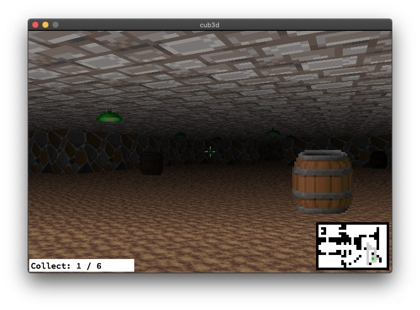
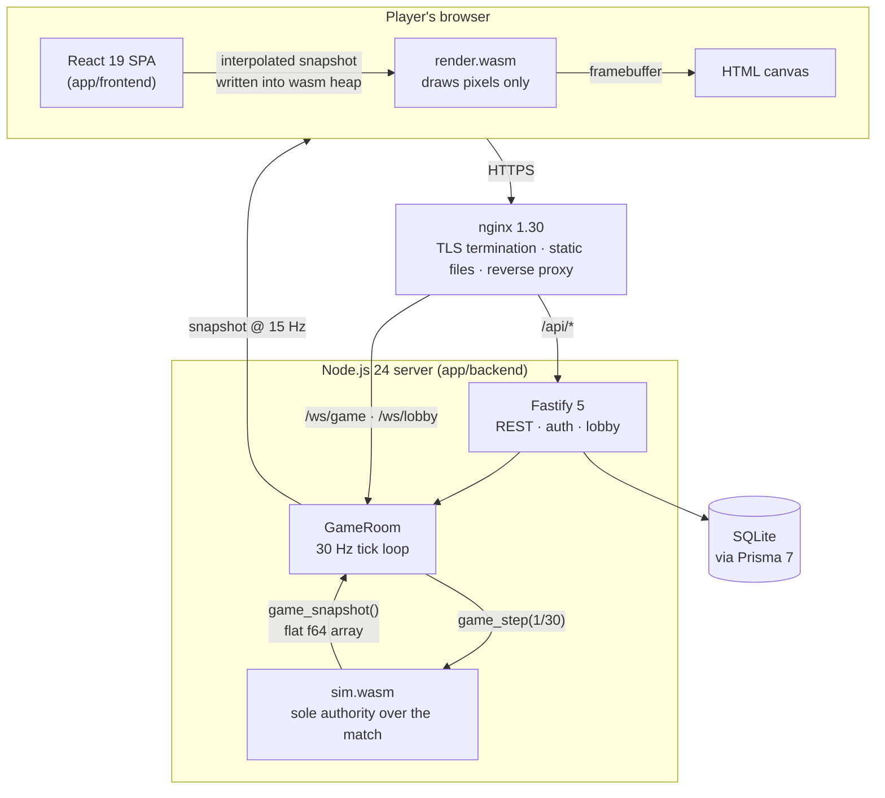
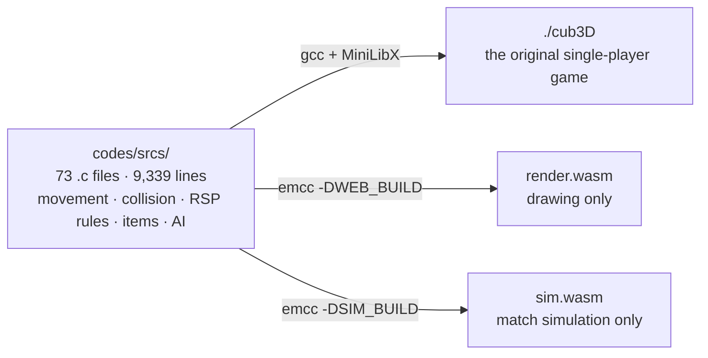
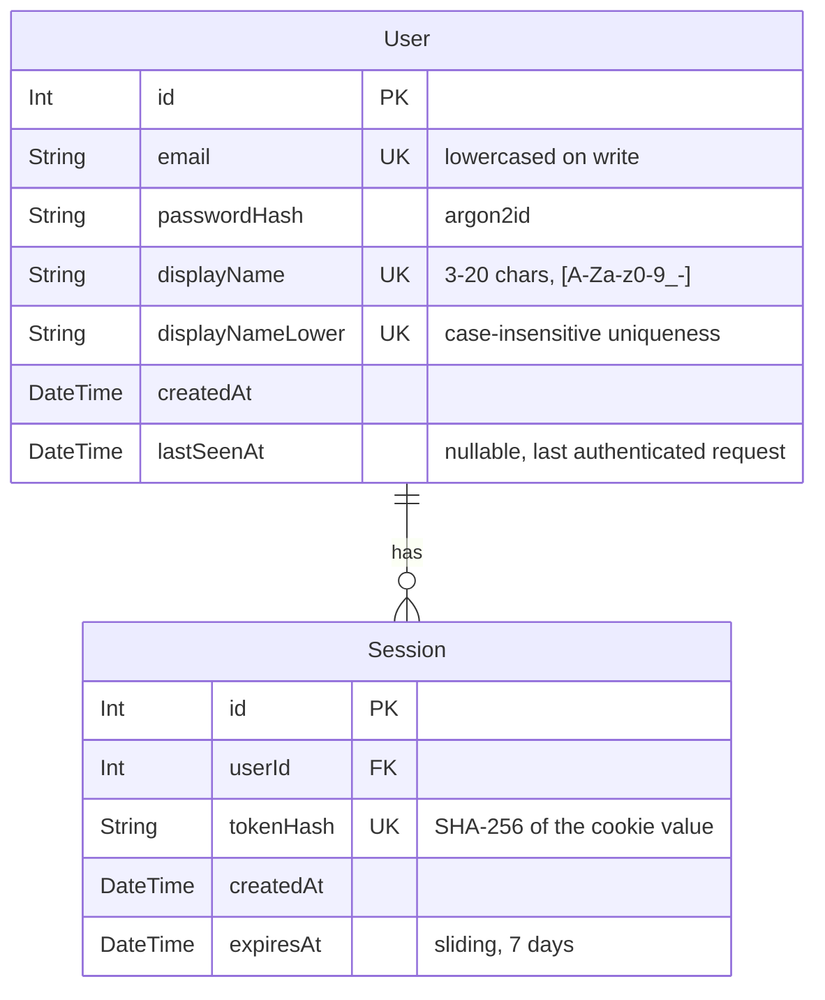

*This project has been created as part of the 42 curriculum by torinoue, ttsubo, kmitsuki, kkurose, tvaroux.*

# ft_transcendence



## Description

**ft_transcendence** is a browser-based online multiplayer game platform. Its goal is to take a
42 `cub3D` engine — a raycasting 3D renderer written in C on top of MiniLibX — and turn it into a
real-time web application where several people play the same match from different computers,
without rewriting the game.

The core idea is that **the same C source is compiled three ways**: natively (the original
single-player game), to `render.wasm` which draws the scene in the browser, and to `sim.wasm` which
runs on the server as the sole authority over every match. There is no duplicated game logic, and
the browser contains no code that decides who wins.

### Key features

- **Two game modes** on one engine:
  - **RSP** — 4 players in two teams of 2. Everyone holds rock, paper or scissors; touching an
    opponent resolves the hand match automatically. You can only change your hand by stepping back
    onto your own team's spawn tile. First team to the target score wins.
  - **FPS** — 1 vs 1. Ten collectibles are shared between both players; once all are collected
    the gate opens and it becomes a race to the goal. Pistols stun the opponent, and map hazards
    roam on their own.
- **Server-authoritative real-time play** at 30 Hz, broadcast to every client at 15 Hz and
  interpolated in the browser.
- **Disconnection handling**: a 30-second grace period during which an AI takes over the seat,
  and reconnection back into the same seat.
- **AI opponents** in both modes, using the same seat and input path as human players.
- **Lobby with custom rooms**: create a room, share a 6-character code, choose the map, target
  score and AI speed, and start the match.
- **Accounts**: email and password sign-up and login, with passwords hashed using argon2id.
- **A 3-minute match time limit**, so that every match ends.
- **A custom design system** of reusable components, design tokens and icons.

---

## Team Information

ft_transcendence is a 4–5-person group project (subject, Chapter II). The **five submitted members**
are:

| Member | GitHub | Role | Responsibilities |
|---|---|---|---|
| **torinoue** | `tototec1234` | Project Manager / Scrum Master | Runs the issue board and milestone schedule, organises the team meetings, tracks blockers and deadlines |
| **ttsubo** | `cacapon` | Technical Lead / Architect | Owns the C engine and its three build targets, the game rules and AI, the authentication API, and the design system |
| **kmitsuki** | `mitsukio-o` | Product Owner | Decides module scope and priorities, triages defects into issues, and owns the lobby screens and the lobby WebSocket client |
| **kkurose** | `kkur0z` | Developer | Owns container infrastructure (TLS, startup migration, startup build), the match lifecycle and result flow, and the game-settings UI |
| **tvaroux** | `tomtomvx` | Developer | Implemented the login and sign-up screens, and simplified the environment and port configuration |

### About the commit history

**`samatsum` is not one of the five submitted members.** They were the sole contributor from the
start of the project until 2026-08-09, holding every role at once, and stepped back from core
membership on 2026-08-23. The foundations from that period — the WebSocket protocol design, the
REST and database design, and the first versions of the game server — are why one non-member
account holds the largest share of the history.

| Author | Commits (excluding merges) |
|---|---|
| samatsum *(not a submitted member)* | 198 |
| ttsubo / `cacapon` | 70 |
| torinoue / `tototec1234` | 21 |
| kmitsuki / `mitsukio-o` | 19 |
| kkurose / `kkur0z` | 17 |
| tvaroux / `tomtomvx` | 11 |

336 non-merge commits across 151 merged pull requests. Commit authors are normalised with
`.mailmap`, so each member is counted once even when they committed from more than one address.

---

## Project Management

### How the work was organised

- **Task distribution.** All work is a GitHub Issue, assigned to one person. Issues are
  distributed at the team meetings, usually to the member who owns that part of the system.
- **Meetings.** The team holds regular, numbered meetings on Discord voice chat. Decisions and
  assignments are recorded as minutes in the Discord server, and the major deadlines are set as
  GitHub Milestones tied to those meetings (for example, the implementation deadline was fixed at
  the 12th meeting).
- **Branch and review flow.** `origin/main` is the single source of truth and nobody commits to it
  directly:

  ```
  branch from origin/main  →  push  →  open PR  →  CI green  →  review  →  squash-merge
  ```

  Branches are named `<type>/<issue-no>-<slug>`. Commits follow Conventional Commits with the issue
  number as scope, e.g. `fix(263): …`; the body explains *why* and ends with the verification
  commands that were actually run. Pull requests are never stacked on top of each other, because a
  squash merge of the lower one would drop the upper one's work.
- **Contracts first.** The WebSocket protocol, REST API and database schema are agreed in writing
  before they are implemented, and a change to a contract updates that agreement in the same pull
  request.

### Tools

| Tool | Used for |
|---|---|
| GitHub Issues | Every task and defect, each with an assignee |
| GitHub Projects | A single Kanban board for the whole project |
| GitHub Milestones | Deadlines (implementation complete, first submission) |
| GitHub pull requests | Code review by at least one member, plus CodeRabbit as an automated reviewer |
| GitHub Actions | CI on every pull request: native C build and tests, WebAssembly build, and the web app's type check, lint, tests and build |

### Communication

- **Discord** — the team's server is the main channel: day-to-day discussion in text channels,
  meetings in a voice channel, and meeting minutes posted in the server.
- **GitHub** — technical discussion that needs to stay attached to the work happens in issue and
  pull request comments.

---

## Technical Stack

### Frontend

| Technology | Why |
|---|---|
| **React 19** + **TypeScript** | The game screen needs real state management (snapshot buffer, HUD, connection state); an SPA is enough, no server-side rendering is needed |
| **Vite** | Fast development server that can proxy `/api` and `/ws` to the backend, so the development setup is same-origin like production |
| **Tailwind CSS v4** | Satisfies the CSS-framework requirement. Colours, typography and spacing are design tokens in `app/frontend/src/index.css`, and an ESLint rule forbids raw colour values so the token system cannot drift |
| **React Router 7** | Client-side routing between the authentication, lobby and game screens |

### Backend

| Technology | Why |
|---|---|
| **Fastify 5** + **TypeScript** on **Node.js 24** | Runs `sim.wasm` directly inside the server process. Lighter than NestJS for this scope, with an official WebSocket plugin |
| **`@fastify/websocket`** (raw WebSocket) | One JSON text frame is one message. Socket.IO's reconnection and room abstractions did not match our protocol, which defines its own reconnection and seat model |
| **`@fastify/rate-limit`**, **`@fastify/cookie`** | Per-client rate limiting behind the reverse proxy, and the session cookie |
| **argon2** | Password hashing with argon2id |

### Database

**SQLite**, accessed through **Prisma 7** (`@prisma/adapter-better-sqlite3`).

Chosen because the whole application runs on one host, so a file-based database needs no extra
service, backup is copying one file, and it satisfies the ORM requirement through Prisma. Prisma
parameterises every query, which removes the SQL-injection surface. The connection runs in WAL
mode so that a write does not block the 30 Hz match loop.

### Other significant technologies

| Technology | Why |
|---|---|
| **C** + **MiniLibX** | The original cub3D engine |
| **Emscripten** → **WebAssembly** | Compiles the same C source into `render.wasm` (browser) and `sim.wasm` (server). This is what removes duplicated game logic |
| **zod** (`app/shared/`) | One schema validates both sides. The frontend and the backend import the same `emailSchema`, `passwordSchema` and `displayNameSchema`, so client-side and server-side validation cannot disagree |
| **nginx 1.30** | TLS termination, same-origin routing of `/api` and `/ws`, and serving pre-compressed textures with `gzip_static` |
| **Docker Compose** | The whole application starts with one command |

### Justification of the major technical choices

- **Compiling the C engine to WebAssembly instead of rewriting it.** The most important decision.
  The same source produces both the renderer and the server simulation, so the game rules exist in
  exactly one place. A rewrite in TypeScript would have created two copies of the rules that had to
  stay in sync forever.
- **A server-authoritative model.** If each client decided outcomes, two players would disagree
  about the same contact, and a client that decides its own outcomes can be modified to always win.
  The cost is a round trip of delay between input and result, which we hide by interpolating.
- **An opaque session cookie instead of a JWT.** It can be revoked on the server, and the browser
  sends it automatically on the WebSocket upgrade, so the game socket needs no separate
  authentication step.

---

## Architecture

### Runtime shape


```mermaid
flowchart TB
    subgraph browser["Player's browser"]
        SPA["React 19 SPA<br/>(app/frontend)"]
        RW["render.wasm<br/>draws pixels only"]
        SPA -->|"interpolated snapshot<br/>written into wasm heap"| RW
        RW -->|"framebuffer"| CV["HTML canvas"]
    end

    NG["nginx 1.30<br/>TLS termination · static files · reverse proxy"]

    subgraph server["Node.js 24 server (app/backend)"]
        BE["Fastify 5<br/>REST · auth · lobby"]
        GR["GameRoom<br/>30 Hz tick loop"]
        SIM["sim.wasm<br/>sole authority over the match"]
        BE --> GR
        GR -->|"game_step(1/30)"| SIM
        SIM -->|"game_snapshot()<br/>flat f64 array"| GR
    end

    DB[("SQLite<br/>via Prisma 7")]

    browser -->|"HTTPS"| NG
    NG -->|"/api/*"| BE
    NG -->|"/ws/game · /ws/lobby"| GR
    GR -->|"snapshot @ 15 Hz"| browser
    BE --> DB
```

### One C source, three targets


```mermaid
flowchart LR
    SRC["codes/srcs/<br/>73 .c files · 9,339 lines<br/>movement · collision · RSP rules · items · AI"]
    SRC -->|"gcc + MiniLibX"| N["./cub3D<br/>the original single-player game"]
    SRC -->|"emcc -DWEB_BUILD"| W["render.wasm<br/>drawing only"]
    SRC -->|"emcc -DSIM_BUILD"| S["sim.wasm<br/>match simulation only"]
```

| | `./cub3D` | `render.wasm` | `sim.wasm` |
|---|---|---|---|
| Platform layer | `platform/native` (MiniLibX/X11) | `platform/web` | `platform/headless` |
| Rendering sources | linked | linked | **16 files excluded** |
| Exported API | — | `_web_render_frame`, `_web_apply_snapshot`, … | `_game_step`, `_game_snapshot`, … |

**`sim.wasm` physically cannot draw, and `render.wasm` physically cannot advance a match.** This is
enforced by the build — `SIM_RENDER_EXCLUDES` and the two `EXPORTED_FUNCTIONS` lists in the
`Makefile` — not by convention.

Two internal seams keep the C code portable: `includes/platform/platform.h` (10 functions with
three implementations) and `includes/core/mode_ops.h` (8 function pointers, one implementation per
game mode). Shared code calls through these tables and never branches on which platform or which
mode it is running in.

### What happens when a key is pressed

1. The browser sends **only input** — `{seq, yaw, mv, act}` — 30 times a second.
2. The server feeds every seat's latest input into `sim.wasm` and advances the world by 1/30 s.
3. The server reads the world back as a **flat array of numbers** (positions, facing, hands, alive
   flags) and broadcasts it as JSON at 15 Hz — about 0.5 KB per snapshot, no pixels.
4. The browser draws the moment `now − 100 ms`, interpolating between the two snapshots around it,
   and hands the result to `render.wasm`, which produces the frame.

The one exception is the player's own view angle, which the client applies immediately so that
looking around is not delayed by the round trip.

---

## Database Schema


```mermaid
erDiagram
    User ||--o{ Session : "has"

    User {
        Int id PK
        String email UK "lowercased on write"
        String passwordHash "argon2id"
        String displayName UK "3-20 chars, [A-Za-z0-9_-]"
        String displayNameLower UK "case-insensitive uniqueness"
        DateTime createdAt
        DateTime lastSeenAt "nullable, last authenticated request"
    }
    Session {
        Int id PK
        Int userId FK
        String tokenHash UK "SHA-256 of the cookie value"
        DateTime createdAt
        DateTime expiresAt "sliding, 7 days"
    }
```

### Tables and relationships

| Table | Purpose | Relationships |
|---|---|---|
| `User` | An account: login email, password hash, display name | One user has many sessions |
| `Session` | One logged-in browser | Belongs to one user; deleted with the user (`onDelete: Cascade`) |

Source of truth: [`app/backend/prisma/schema.prisma`](./app/backend/prisma/schema.prisma). The
migration is applied automatically when the backend container starts.

### Design notes

- **`Session` stores a hash, not the token.** The cookie carries 32 random bytes; the database keeps
  only their SHA-256. A copy of the database does not give anyone a usable session.
- **`displayNameLower` exists on purpose.** Display names must be unique regardless of case, but
  SQLite via Prisma cannot declare an expression index or `COLLATE NOCASE` from the schema. Keeping
  the lowercased value in its own `@unique` column lets the database enforce the rule instead of
  application code.

---

## Features List

| Feature | What it does | Member(s) |
|---|---|---|
| C raycasting engine | Renders the 3D view by casting one ray per screen column; walls, floor, ceiling, sprites and lighting | ttsubo |
| Three-target build | Compiles the engine to native, `render.wasm` and `sim.wasm` from the same source | ttsubo |
| RSP mode rules | Contact resolves rock-paper-scissors; scoring, respawn, and changing hands at your own spawn | ttsubo |
| FPS mode rules | Shared collectibles, gate door, goal; the goal is refused until everything is collected | ttsubo |
| Shooting (FPS) | Space fires the pistol from the browser through to the server simulation | ttsubo |
| AI opponents | AI seats in both modes; RSP AI changes hands correctly after draws and respawns | ttsubo, kmitsuki |
| Match time limit | Ends every match after 3 minutes with a `timeout` reason, shown as a countdown in the HUD | ttsubo |
| Authentication API | Sign-up, login, logout and `me` endpoints with argon2id and session cookies | ttsubo |
| Login screen | Email and password form with per-field validation errors | tvaroux |
| Sign-up screen | Account creation form with per-field validation errors | tvaroux |
| Post-login return | Returns the user to the page they were on before logging in | kmitsuki |
| Session resilience | A temporary network failure or backend restart no longer looks like a logout; the user can retry | kmitsuki |
| Lobby hub | The landing screen after login, with logout | kmitsuki |
| Room creation and joining | Create a room and get a 6-character code, or join one by code | kmitsuki |
| Lobby WebSocket client | Keeps the lobby connection, room state and presence in the browser | kmitsuki |
| Matching screen | The waiting room before a match, with the room's rules | kmitsuki |
| Game-settings UI | Choose map, RSP target score and FPS AI speed when creating a room | kkurose |
| Match result screen | Shows the result when a match ends and returns to the lobby | kkurose |
| Leaving and re-entering | After leaving a match, a player can create or join another room | kkurose |
| Countdown for everyone | The 3-2-1 countdown reaches every player, including the last to join | kkurose |
| FPS HUD | Collectible counter; only real seats are listed as players | kkurose |
| Weapon switching (FPS) | Keys 1/2/3 switch weapon from input through the simulation to the rendered hand | kmitsuki |
| Own death screen | The "you died" screen appears in online matches | kmitsuki |
| Opponent status in HUD | Shows when an opponent is dead and how long until they come back | ttsubo |
| Mode-aware texture loading | Loads only the textures a mode needs (75 MB less in RSP) | kmitsuki |
| Controls / how-to-play page | In-app manual of controls and rules | torinoue |
| Responsive layout | Screens adapted down to a 375 px width | torinoue |
| Design system | Reusable components, colour and typography tokens, icons, and a catalogue page | ttsubo, kmitsuki |
| Privacy Policy and Terms of Service | Real policy pages based on the actual data the app stores, linked from the footer | ttsubo |
| HTTPS and reverse proxy | nginx TLS termination and routing of `/api` and `/ws` | kkurose |
| One-command startup | Migration and WebAssembly/frontend builds run as part of `docker compose up` | kkurose |
| Crash resistance | Errors during WebSocket authentication or in the match loop no longer stop the server | kkurose |
| Zero-configuration startup | Works without a `.env` file; the HTTPS port and allowed origin default to matching values | tvaroux |
| Per-client rate limiting | Rate limits apply per real client IP behind the proxy, not shared by everyone | kmitsuki |
| Non-blocking database writes | Authentication no longer writes on every request, and the database runs in WAL mode | kmitsuki |

---

## Modules

### Point calculation

| # | Module (as named in the subject) | Category | Type | Points |
|---|---|---|---|---|
| 1 | Implement a complete web-based game where users can play against each other | Gaming | Major | 2 |
| 2 | Remote players | Gaming | Major | 2 |
| 3 | Multiplayer game (more than two players) | Gaming | Major | 2 |
| 4 | Use a framework for both the frontend and backend | Web | Major | 2 |
| 5 | Implement real-time features using WebSockets or similar technology | Web | Major | 2 |
| 6 | Introduce an AI Opponent for games | AI | Major | 2 |
| 7 | Use an ORM for the database | Web | Minor | 1 |
| 8 | Game customization options | Gaming | Minor | 1 |
| | **Mandatory total** — 6 Major × 2 + 2 Minor × 1 | | | **14** |
| 9 | Custom-made design system with reusable components | Web | Minor | 1 |
| | **Bonus total** | | | **1** |

No custom "Modules of choice" are claimed.

### Justification, implementation and members

**1. Implement a complete web-based game where users can play against each other** — Major, 2 pts
*Members: ttsubo, kmitsuki, kkurose*

- *Why:* the core deliverable — the cub3D engine made playable by several people in a browser.
- *How:* the engine is compiled to `render.wasm` for drawing and `sim.wasm` for the match. Players
  play **live matches** in two modes with **clear rules and win/loss conditions**: RSP ends when a
  team reaches the target score, FPS when a player reaches the goal, and either mode ends on the
  3-minute time limit. The game is **3D**.
- *Code:* [`codes/`](./codes), [`GameView.tsx`](./app/frontend/src/pages/GameView.tsx),
  [`game/room.ts`](./app/backend/src/game/room.ts)

**2. Remote players** — Major, 2 pts
*Members: kkurose, kmitsuki, ttsubo*

- *Why:* the reason for the architecture — two people on separate computers in the same match.
- *How:*
  - **Network latency** — the server is authoritative and the client draws `now − 100 ms`,
    interpolating between snapshots, so late or uneven packets do not cause jumps. The player's own
    view angle is applied locally so looking around has no delay.
  - **Disconnections** — a dropped player gets a 30-second grace period; an AI plays the seat
    meanwhile and other players are notified.
  - **Reconnection logic** — the client reconnects automatically; the server recognises the
    returning user, gives the seat back and sends the current state immediately.
- *Code:* [`game/room.ts`](./app/backend/src/game/room.ts),
  [`useGameSocket.ts`](./app/frontend/src/game/useGameSocket.ts),
  [`interpClock.ts`](./app/frontend/src/game/interpClock.ts)

**3. Multiplayer game (more than two players)** — Major, 2 pts
*Members: ttsubo, kmitsuki, kkurose*

- *Why:* RSP is designed as 2 vs 2 — four players at once.
- *How:* **four players simultaneously** in two teams. **Fair mechanics**: both teams use
  mirrored spawns and the same rules, enforced by the single server simulation. **Synchronisation
  across all clients**: there is exactly one simulation per match, and every client receives the
  same snapshot.
- *Code:* [`lobby/rooms.ts`](./app/backend/src/lobby/rooms.ts),
  [`codes/srcs/rsp/`](./codes/srcs/rsp)

**4. Use a framework for both the frontend and backend** — Major, 2 pts
*Members: all five*

- *Why:* running `sim.wasm` inside the server requires a Node backend we control, and the game
  screen needs real state management.
- *How:* **React** for the frontend, **Fastify** for the backend.
- *Code:* [`app/frontend/`](./app/frontend), [`app/backend/`](./app/backend)

**5. Implement real-time features using WebSockets or similar technology** — Major, 2 pts
*Members: kmitsuki, kkurose*

- *Why:* match state and lobby state must reach every player without polling.
- *How:* two sockets, `/ws/game` and `/ws/lobby`.
  - **Real-time updates across clients** — match snapshots at 15 Hz, lobby rooms and presence.
  - **Connection and disconnection** — authentication on the upgrade, defined close codes, heartbeat,
    grace period, and replacement of an older connection by the same user.
  - **Efficient broadcasting** — a snapshot is serialised once per room and sent to every
    connection; under back-pressure a snapshot may be skipped (the next one is complete) but events
    are always delivered.
- *Code:* [`game/ws.ts`](./app/backend/src/game/ws.ts),
  [`lobby/ws.ts`](./app/backend/src/lobby/ws.ts)

**6. Introduce an AI Opponent for games** — Major, 2 pts
*Members: ttsubo, kmitsuki, kkurose*

- *Why:* lets a match fill empty seats, and keeps a match going when a human disconnects.
- *How:* AI seats use the same seat model and input path as humans, and
  `game_set_input_source` switches a seat between human and AI at runtime.
  - **Challenging and able to win** — AI-only RSP matches reach the target score on their own.
  - **Human-like, not perfect** — the RSP AI only reacts to the nearest opponent, chasing when its
    hand wins, fleeing when it loses and heading home to change hands after a draw. The FPS AI only
    notices a player inside its field of view **with a clear line of sight**, loses track when the
    player breaks sight, and patrols in the meantime.
  - **Uses the customization options** — the AI plays on whichever map is chosen, towards the
    chosen target score, and at the chosen AI speed.
- *Code:* [`rsp/enemy/rsp_enemy_ai.c`](./codes/srcs/rsp/enemy/rsp_enemy_ai.c),
  [`fps/enemy/fps_enemy_ai.c`](./codes/srcs/fps/enemy/fps_enemy_ai.c),
  [`fps/enemy/fps_enemy_sense.c`](./codes/srcs/fps/enemy/fps_enemy_sense.c)

**7. Use an ORM for the database** — Minor, 1 pt
*Members: ttsubo, kkurose, kmitsuki*

- *Why:* a database is required anyway (Chapter III), and an ORM gives typed, parameterised queries.
- *How:* **Prisma**, with the schema and migration in `app/backend/prisma/`; the migration is
  applied on container start.
- *Code:* [`schema.prisma`](./app/backend/prisma/schema.prisma),
  [`db/client.ts`](./app/backend/src/db/client.ts)

**8. Game customization options** — Minor, 1 pt
*Members: kkurose*

- *Why:* lets the room host shape the match.
- *How:* when creating a room the host chooses **the map** (two per mode), **the RSP target score**
  and **the FPS AI speed** (slow, normal, fast). **Defaults are always available**: `rsp` and
  `fps_duel` are the default maps, and every setting has a default value.
- *Code:* [`GameCustomizationFields.tsx`](./app/frontend/src/lobby/GameCustomizationFields.tsx),
  [`game/maps.ts`](./app/backend/src/game/maps.ts)

**9. Custom-made design system with reusable components** — Minor, 1 pt (bonus)
*Members: ttsubo, kmitsuki*

- *How:* 17 reusable components (above the required 10) — Button, Input, Select, Modal, Toast,
  Card, Alert, FormField and others — plus a colour palette and typography as design tokens, an icon set, and a live catalogue page at `/dev/design-system`. Raw colour values
  are rejected by an ESLint rule.
- *Code:* [`app/frontend/src/components/`](./app/frontend/src/components)

---

## Individual Contributions

### torinoue — Project Manager / Scrum Master

- **Contributed:** ran the issue board and the milestone schedule and organised the team meetings;
  implemented the controls and how-to-play page (#156) and the 375 px responsive layout pass (#195);
  wrote the pull request process template (#160); added the subject and its Japanese translation to
  the repository (#51); normalised commit authorship with `.mailmap` (#290).
- **Challenges:** rejoined the project on 2026-08-28 under a new GitHub account after the original
  team dissolved, and had to re-establish the schedule and role hand-over with a re-formed team.

### ttsubo — Technical Lead / Architect

- **Contributed:** designed and built the C engine and its three build targets; the RSP and FPS
  rules, shooting (#216) and AI; the authentication API (#122); the design system (#98, #219, #236,
  #237) and the lint rule against raw colours (#250); the Privacy Policy and Terms of Service
  (#97); gzip delivery of textures and deployment (#192, #225); the match time limit (#280).
- **Challenges:**
  - *RSP AI that never finished a match.* An AI already standing on its spawn could not change hand
    after a draw. Fixed the state that respawning left stale (#282), and added a 3-minute limit as a
    safety net (#280). The limit counts simulation ticks rather than wall-clock time, so a slow
    server does not shorten the time players actually get.
  - *A heap overflow in the map parser,* triggered by trailing spaces in a map line. Found and
    confirmed with an AddressSanitizer build of the C test suite, then fixed (#279).
  - *Container start-up took about 50 seconds;* reduced to about 7 (#159).

### kmitsuki — Product Owner

- **Contributed:** decided the module scope and triaged the defect backlog into assigned issues;
  implemented the lobby hub (#127), room creation and joining (#132), the lobby WebSocket client
  (#157) and the matching screen (#176); weapon switching across the whole input-to-render path
  (#249); the online death screen (#235); mode-aware texture loading (#211); post-login return
  (#212).
- **Challenges:**
  - *Everyone shared one rate-limit bucket behind nginx,* so one person mistyping a password five
    times locked out every user. Passed the real client IP from nginx and trusted exactly one proxy
    hop in Fastify, overwriting rather than appending the forwarded header so it cannot be spoofed
    (#273).
  - *Every login froze running matches,* because authentication wrote to SQLite synchronously on
    every request. Reduced the writes to at most once per minute or hour and switched the database
    to WAL (#274).
  - *A backend restart looked like a logout,* because any failed session check was treated as "not
    logged in". Separated "the server said no" from "the server could not be reached" (#275).
  - *RSP AI stopped moving after a draw* (#252).

### kkurose — Developer

- **Contributed:** container infrastructure — nginx TLS termination and the REST/WebSocket proxy
  (#143), running the database migration on start (#126) and building WebAssembly and the frontend
  on start (#131); the game-settings UI (#181) and FPS AI speed end to end (#185, #228); the match
  result screen and transition (#209); the FPS collectible counter (#231); returning to the lobby
  after a match (#248).
- **Challenges:**
  - *A player who left an RSP match could not create or join another room* (#243).
  - *Errors during WebSocket authentication could stop the whole backend.* Added error handling to
    the connection handler and the match loop (#281).
  - *The player who joined last did not receive the countdown* (#284).
  - *Making TLS, migrations and the WebAssembly build all happen inside a single
    `docker compose up`* with no manual steps (#126, #131, #143).

### tvaroux — Developer

- **Contributed:** implemented the login screen (#161) and the sign-up screen (#178), including the
  per-field validation messages driven by the shared zod schemas; simplified the environment
  configuration so the application starts without a `.env` file, aligning the HTTPS port with the
  allowed origin and removing an unused session secret (#286).
- **Challenges:** joined the project late in the schedule — full-time commitment started on
  2026-10-07 — and had to get productive inside an existing codebase quickly.

---

## Instructions

### Prerequisites

| Requirement | Version |
|---|---|
| **Docker** with the **Compose v2** plugin (`docker compose`, not `docker-compose`) | tested with Docker 29.5 and Compose 5.1 |
| **Git** | any recent version |
| A free TCP port | **8443** (HTTPS) |
| Browser | latest stable Google Chrome |

For development without Docker you additionally need **Node.js ≥ 20.17** and **npm 11**.

### Configuration (`.env`)

**No `.env` file is required** — every variable has a working default, and the HTTPS port and the
allowed origin default to matching values (`8443` and `https://localhost:8443`).

To customise, copy the example and edit it:

```bash
cp .env.example .env
```

`.env` is git-ignored and no credentials are committed to the repository. If you change the port,
set **both** `HTTPS_PORT` and `ALLOWED_ORIGIN`: the origin check is an exact string match, so changing
one without the other breaks login and both WebSockets.

### Run

```bash
git clone <this repository> ft_transcendence    # into an empty folder
cd ft_transcendence
docker compose up --build
```

Then open **<https://localhost:8443>**.

The first run takes about ten minutes. It builds the images, compiles the WebAssembly targets with
Emscripten, generates a local certificate authority and a `localhost` certificate, applies the
database migration, and builds the frontend. There are no manual steps.

- **The certificate is self-signed**, so the browser warns on the first visit. Choose "Advanced" →
  "Proceed to localhost".
- **`engine-build` and `frontend` exit when they finish.** They are one-shot build steps that
  produce the WebAssembly files and the frontend bundle. Only `nginx` and `backend` keep running, so
  seeing the other two as `Exited (0)` is expected.

Stop with `Ctrl-C`, or `docker compose down`. Add `-v` to also delete the database volume.

### Development without Docker

```bash
npm install
echo 'ALLOWED_ORIGIN=http://localhost:5173' >> .env
npm run dev
```

The WebAssembly files still have to be built once with Emscripten — use the container for that:
`docker compose run --rm engine-build`.

### Tests

```bash
npm run typecheck     # shared / backend / frontend
npm test              # vitest — 23 files, 205 tests
npm run lint          # eslint, no warnings allowed
npm run build

docker compose run --rm engine-build make test    # C acceptance tests — 168 checks, no X11 needed
docker compose run --rm engine-build make check   # 13 C coding-rule checks
```

`make test` builds a headless native simulation and checks scoring, the FPS goal and collection
gate, hazards and all four online maps. It runs in CI on every pull request. It can also be built
with AddressSanitizer to catch memory errors in the C code:

```bash
docker compose run --rm engine-build make test CC="cc -fsanitize=address -g"
```

---

## Controls

| Input | Action |
|---|---|
| `W` / `S` | Move forward / backward |
| `A` / `D` | Strafe left / right |
| `←` / `→` | Turn left / right |
| `1` / `2` / `3` | Switch weapon (pistol / flashlight / bare hands) — **FPS only** |
| `Space` | Fire (pistol only, with a cooldown) — **FPS only** |
| `I` | Toggle the minimap and collection progress |
| `O` | Toggle the crosshair |
| `L` | Toggle distance shading |
| `Esc` | Release the pointer / open the exit prompt |

In RSP mode `1`/`2`/`3`/`Space` are disabled — hand matches resolve on contact.

---

## Known limitations

- **The local certificate is self-signed**, so browsers show a warning on the first visit.
- **FPS matches that hit the time limit are always a draw.** The collectible counter is shared
  between both players, so there is no per-player count to decide a winner.

---

## Resources

**Raycasting and the original engine**

- [Lode's Computer Graphics Tutorial — Raycasting](https://lodev.org/cgtutor/raycasting.html)
- [A first-person engine in 265 lines (PlayfulJS)](http://www.playfuljs.com/a-first-person-engine-in-265-lines/)
- [42Paris / minilibx-linux](https://github.com/42Paris/minilibx-linux)
- [BMP format reference](https://stackoverflow.com/questions/2654480/writing-bmp-image-in-pure-c-c-without-other-libraries)

**WebAssembly and Emscripten**

- [WebAssembly — official site](https://webassembly.org/)
- [WebAssembly — MDN Web Docs](https://developer.mozilla.org/en-US/docs/WebAssembly)
- [Emscripten documentation](https://emscripten.org/docs/)
- [Emscripten — Building projects](https://emscripten.org/docs/compiling/Building-Projects.html)
- [Emscripten — Interacting with code](https://emscripten.org/docs/porting/connecting_cpp_and_javascript/Interacting-with-code.html)
  — exported functions and reading the wasm heap from JavaScript; how `render.wasm` and `sim.wasm`
  exchange data with TypeScript
- [Emscripten — Settings reference](https://emscripten.org/docs/tools_reference/settings_reference.html)
  — `MODULARIZE`, `ALLOW_MEMORY_GROWTH` and `EXPORTED_FUNCTIONS`, as used in the `Makefile`

### How AI was used

The architecture, the game rules, the protocol and database design, and the module scope were
decided by the developers. AI coding assistants (Claude Code) were used as an implementation aid,
working from those decisions:

| Task | Parts of the project |
|---|---|
| Scaffolding and boilerplate | React screens and components, REST route handlers, zod schemas |
| Build configuration | Emscripten flags in the `Makefile`, Dockerfiles, Compose and CI |
| Tests | vitest unit tests and the C acceptance test cases |
| Investigation | Reproducing and narrowing down defects before they were filed as issues |
| Documentation drafts | This README, reviewed and corrected by the team |

Every change goes through a pull request and human review, and we only merge code we understand and
can explain.
