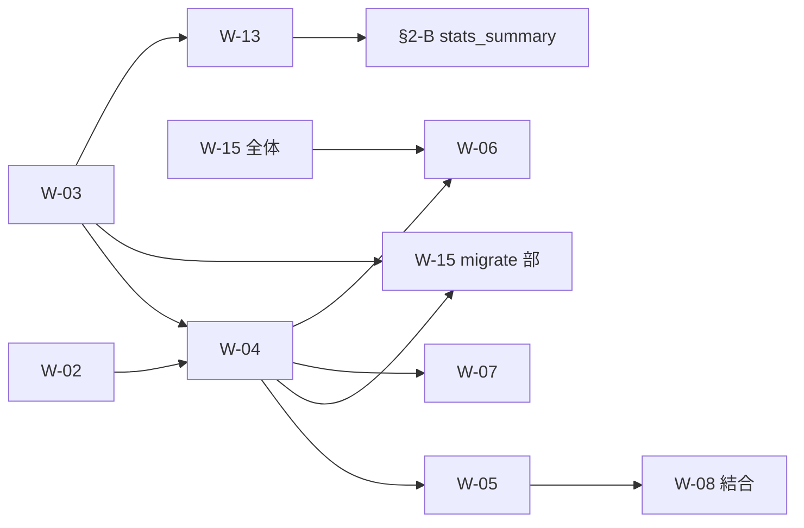

# torinoue 作業見積もり（60分スロット）

> 対象: torinoue（Auth / REST / DB / DevOps レーン）  
> 関連: [reading_guide_torinoue.md](./reading_guide_torinoue.md) §4「第一手（現状 → W-02）」  
> 作成: 2026-07-30（AI 草案 → 本人レビュー前提）  
> **契約の正本ではない**。受入条件・依存は [02_設計書/5-バックログ.md](../02_設計書/5-バックログ.md) が正。

---

## 1. このドキュメントの目的

torinoue 担当分野の**残作業を W 単位に分解**し、**60分スロット**（1スロット = 60分、60分未満のタスクも1スロット割当＝バッファ込み）で総量を見積もる。

- 1日あたりの稼働時間は**考慮しない**
- 他メンバーの待ち時間は**度外視**
- 他プロジェクトに割く時間を削減して、この総スロット数を消化するための計画用

---

## 2. 見積もり前提（2026-07-30 セッションで合意）

| # | 前提 |
|---|---|
| 1 | スコープは **W ごと**（+ 契約上 torinoue 所有の REST 残） |
| 2 | トータルスロット数から要求作業時間を見積もる（日割りは別途） |
| 3 | 他メンバーの作業待ちは度外視 |
| 4 | **すべて初見** — 各 W 末尾にデバッグ用スロットを織り込み済み |
| 5 | mamiyaza 等との同期は度外視 |
| 6 | 受入検証は **curl のみ** |
| 7 | **手戻りが少ない順** — W-03 はローカル migrate まで、**compose 初回 migrate は W-15（W-04 後）** |
| 8 | `ALLOW_DEV_AUTH` + `x-dev-user` の dev stub は **W-04 完成まで維持** |

---

## 3. スコープ

### 3.1 含む

| 区分 | 内容 |
|---|---|
| 必須 W | W-02, W-03, W-04, W-05, W-15, W-13 |
| ゲート3 用 W | W-06, W-07 |
| REST 残（W 番号なし） | ③§2-B のうちアバター以外（`GET /api/users/:id`, `PATCH /api/users/me`） |
| 結合 | W-08 への本 Cookie / Origin 結合確認 |
| レビュー | W-14（samatsum 実装済み・契約レビューのみ） |
| DevOps | W-16（CI） |
| 提出 | H-01 の REST / セキュリティ担当分 |

### 3.2 含まない

| 区分 | 理由 |
|---|---|
| W-01 | samatsum 完了済み |
| W-08〜W-12, W-14 の**実装** | samatsum 完了（torinoue は結合・レビューのみ） |
| Frontend（F-xx） | mamiyaza / hminemur レーン |
| PM / SM | 定例・進捗管理（本見積もりに未計上） |

---

## 4. W 別スロット一覧

| W | 内容 | スロット | 作業時間 |
|---|---|---:|---:|
| **W-02** | Fastify 基盤（pino・zod パイプライン・EH・レート制限） | **7** | 7h |
| **W-03** | Prisma + SQLite（5 テーブル・ローカル migrate） | **5** | 5h |
| **W-04** | 認証一式（signup/login/logout/me・argon2id・Session Cookie） | **8** | 8h |
| **W-05** | Origin 検証 + W-08 本 Cookie 結合 | **5** | 5h |
| **W-15** | Docker Compose + nginx TLS + 単一コマンド起動 | **9** | 9h |
| **W-13** | 試合永続化 + `match_result` + 履歴/統計 API | **7** | 7h |
| **§2-B** | ユーザー API（アバター除く） | **2** | 2h |
| **W-06** | アバターアップロード + nginx 静的配信 | **4** | 4h |
| **W-07** | フレンド API 一式 | **5** | 5h |
| **W-14** | 契約レビュー（`GET /api/maps`） | **1** | 1h |
| **W-16** | CI | **4** | 4h |
| **H-01** | REST / セキュリティ（提出前） | **3** | 3h |
| | **合計** | **60** | **60h** |

### 4.1 総括

| 指標 | 値 |
|---|---|
| 総スロット数 | **60** |
| 総作業時間（見込み） | **60 時間** |
| 1日 8h 換算 | 約 7.5 営業日分 |
| 1日 4h 換算 | 約 15 日分 |

> 初見で W-15 や W-13 が膨らむ場合は **+3〜5 スロット** を別途見ておく。PM 時間は **+5〜8 スロット** 程度が目安（本表に未計上）。

---

## 5. 推奨着手順（手戻り最小）

```text
W-02 → W-03 → W-04 → W-05 → W-15 → W-13 → §2-B → W-06 → W-07
  → W-14（レビュー） → W-16 → H-01
```

| スロット範囲 | 時間 | マイルストーン |
|---|---:|---|
| 1〜25 | 25h | ゲート2 サーバ側クリティカルパス（auth + Origin） |
| 26〜34 | 9h | 評価必須 compose（拒否条件） |
| 35〜52 | 18h | ゲート3 モジュール #6 / #8 |
| 53〜60 | 8h | 仕上げ・CI・提出前 |

---

## 6. スロット内訳（1〜60）

### W-02（スロット 1〜7）

> **着手チェックリスト + curl 受入**: [torinoue_W02_着手チェックリスト.md](./torinoue_W02_着手チェックリスト.md)

| # | 内容 |
|---|---|
| 1 | Spike：[03 REST_API設計](../02_設計書/3-REST_API設計.md) §1、`fastify-type-provider-zod` / `@fastify/rate-limit`、ファイル配置決定 |
| 2 | pino 本設定（redact: password/token/cookie、LOG_LEVEL） |
| 3 | グローバルエラーハンドラ（ZodError → `validation_failed`、その他 → `internal_error`） |
| 4 | zod 検証パイプライン + `shared/api/` 骨格 |
| 5 | `/api/maps` をパイプライン経由に移行 |
| 6 | レート制限（auth 5/min、変更系 30/min、GET 120/min） |
| 7 | curl 受入（400/429 エンベロープ）+ 初見デバッグ → 上記チェックリスト §5.3 |

**受入（[05 バックログ](../02_設計書/5-バックログ.md) W-02）**: 不正入力が ③§1-A の形で 400/429 になる。

### W-03（スロット 8〜12）

| # | 内容 |
|---|---|
| 8 | Prisma 導入 + 5 モデル schema 起草（User / Session / Friendship / Match / MatchPlayer） |
| 9 | 一意制約（email 小文字、displayName 大小無視一意） |
| 10 | `migrate dev` + Client シングルトン + `DATABASE_URL` |
| 11 | ローカル DB 接続確認 |
| 12 | 初見デバッグ |

**受入（W-03）**: `prisma migrate` が compose 初回起動に組み込まれる — **compose 側は W-15 スロット 30 で実施**。

### W-04（スロット 13〜20）

| # | 内容 |
|---|---|
| 13 | `shared/api/auth.ts`（signup/login/self、snake_case ワイヤ） |
| 14 | argon2id ユーティリティ（③§2-A パラメータ） |
| 15 | セッション（トークン生成・SHA-256 保存・Cookie・スライディング延長） |
| 16 | `POST /api/auth/signup` |
| 17 | `POST /api/auth/login`（失敗メッセージ非区別） |
| 18 | `POST /api/auth/logout` + `closeSessionConnections` 配線 |
| 19 | `GET /api/auth/me` + `authenticateRequest` 本実装（dev stub 分岐は残す） |
| 20 | curl 通し + 初見デバッグ |

**受入（W-04）**: ③§2-A の全動作 + ログイン失敗の非区別応答。

**差し替え正本**: `app/backend/src/auth/session.ts`（Issue #11 合意シグネチャ。呼び出し側は変更不要）。

### W-05（スロット 21〜25）

| # | 内容 |
|---|---|
| 21 | `isAllowedOrigin` 本実装（`ALLOWED_ORIGIN`） |
| 22 | REST 変更系（POST/PATCH/PUT/DELETE）Origin hook |
| 23 | WS upgrade 経路の確認・調整（`lobby/ws.ts` / `game/ws.ts` は既に呼び出し済み） |
| 24 | W-08 本 Cookie 結合確認（lobby 経路） |
| 25 | 異 Origin 拒否 curl + バッファ |

**受入（W-05）**: 異 Origin の変更系 / WS が拒否される。

### W-15（スロット 26〜34）

| # | 内容 |
|---|---|
| 26 | compose 骨格（backend / frontend / nginx / volumes） |
| 27 | TLS 自己署名・初回生成スクリプト |
| 28 | `engine-build` 組込（空 `web/build/` → wasm 生成） |
| 29 | `HOST_UID` / `HOST_GID` 権限 |
| 30 | compose 初回 `prisma migrate`（W-04 後） |
| 31 | nginx（`/api`, `/ws`, FE 静的、`/avatars` 枠） |
| 32 | 環境変数配線（`SESSION_SECRET`, `DATABASE_URL`, `ALLOWED_ORIGIN` 等） |
| 33 | 空 clone → `docker compose up` 通し試験 |
| 34 | 通し試験デバッグ |

**受入（W-15）**: 空フォルダ `git clone` → `docker compose up` → Chrome で HTTPS 接続。  
**落としやすい点**: [infra/README.md](../../infra/README.md) の `web/build/` 空・`HOST_UID`/`HOST_GID` 節を参照。

### W-13（スロット 35〜41）

| # | 内容 |
|---|---|
| 35 | `persistMatch` 実装（Match / MatchPlayer 書込） |
| 36 | ロビー `match_result` 配信 |
| 37 | `shared/api` matches/stats zod |
| 38 | `GET /api/matches` + ページネーション |
| 39 | `GET /api/matches/:id` |
| 40 | `GET /api/users/:id/stats`（win_rate 規約） |
| 41 | curl №1/№3 + バッファ |

**受入（W-13）**: №1 成立→決着→DB 行→ロビー受信の通し。№3 カスタムルーム `target_score=3` で 3 点決着。

**結合点**: `app/backend/src/game/room.ts` の `persistMatch` コールバック（samatsum 側は実装済み）。

### §2-B ユーザー API（スロット 42〜43）— W 番号なし

| # | 内容 |
|---|---|
| 42 | `GET /api/users/:id`（公開プロフィール + stats_summary） |
| 43 | `PATCH /api/users/me`（display_name / password 変更） |

**根拠**: ゲート3 モジュール #6（標準的なユーザー管理）の REST 側。③§2-B。

### W-06（スロット 44〜47）

| # | 内容 |
|---|---|
| 44 | multipart + 2MB / Content-Type 検証（413/415） |
| 45 | マジックバイト + `/data/avatars` 保存 |
| 46 | nginx `/avatars` 静的配信（W-15 上に追加） |
| 47 | curl 境界テスト + バッファ |

**受入（W-06）**: 2MB 超 / 偽 Content-Type / 不正マジックバイトが 413/415。

**依存**: W-15 の nginx 枠（スロット 31）が先。

### W-07（スロット 48〜52）

| # | 内容 |
|---|---|
| 48 | `shared/api/friends` zod |
| 49 | `FriendResolver` Prisma adapter（`lobby/state.ts` の interface へ差し込み） |
| 50 | `GET /api/friends`（presence 合成） |
| 51 | POST/accept/delete + 409 系 |
| 52 | curl + 双方向重複 + バッファ |

**受入（W-07）**: 双方向重複・自己申請が 409。presence 合成が返る。

### W-14 レビュー（スロット 53）

| # | 内容 |
|---|---|
| 53 | ③§2-E 契約 vs 現行 `GET /api/maps` の curl レビュー（実装は samatsum 完了） |

### W-16（スロット 54〜57）

| # | 内容 |
|---|---|
| 54 | GitHub Actions 骨格 |
| 55 | backend（typecheck, check:lobby）+ `make check` |
| 56 | FE lint / 型検査 |
| 57 | 初回 CI 赤解消 |

**受入（W-16）**: 毎 PR 自動実行。

### H-01 torinoue 分（スロット 58〜60）

| # | 内容 |
|---|---|
| 58 | REST 攻撃バッテリー（SQLi / XSS 入力系） |
| 59 | pino redact / 秘密情報スキャン対応 |
| 60 | §9.1 REST チェックリストクローズ |

---

## 7. 現状との対応（reading_guide §4）

| 済み（触って確認） | 本見積もりでの W |
|---|---|
| Fastify 起動、`GET /api/health` | W-02 の出発点（スロット 1 以前） |
| 404 がエラーエンベロープ形 | W-02 スロット 3 でグローバル EH へ拡張 |
| `error.ts` / `health.ts` の骨格 | W-02 スロット 4 |
| FE が health を zod で parse | 変更なし |
| `auth/session.ts`（dev stub） | W-04 スロット 19、W-05 スロット 21〜25 |
| `game/` / `lobby/` / `shared/ws/` | 結合のみ（W-05 スロット 24）。実装は samatsum 完了 |

| 未着手（torinoue の作業） | 本見積もりでの W |
|---|---|
| pino 本設定、zod 検証パイプライン | W-02 |
| レート制限、グローバルエラーハンドラ | W-02 |
| 認証用 zod、Prisma、Session Cookie | W-03, W-04 |
| `/api/auth/*` | W-04 |
| `authenticateRequest` / `isAllowedOrigin` 本実装 | W-04, W-05 |

---

## 8. 依存関係（参考）



詳細: [torinoue_PERT依存図.md](../torinoue/torinoue_PERT依存図.md)

---

## 9. 正本リンク

| 資料 | 用途 |
|---|---|
| [02_設計書/5-バックログ.md](../02_設計書/5-バックログ.md) §4 | W-xx 受入条件 |
| [02_設計書/3-REST_API設計.md](../02_設計書/3-REST_API設計.md) | REST 契約 |
| [02_設計書/6-チーム分担計画.md](../02_設計書/6-チーム分担計画.md) §3, §5.1 | 担当・日割り（**日程の正本**。本 doc のスロット数とは独立） |
| [torinoue_データフロー図.md](../torinoue/torinoue_データフロー図.md) | インターフェース |
| `app/backend/src/index.ts` | W-02 出発点 |
| `app/backend/src/auth/session.ts` | W-04/W-05 差し替え正本 |

---

## 10. 後日更新

| 日付 | 内容 |
|---|---|
| 2026-07-30 | 初版作成（60スロット見積もり。前提 8 項目合意） |
