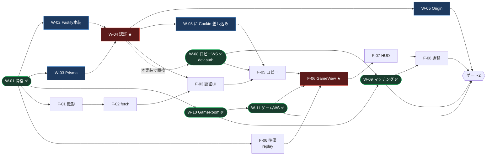
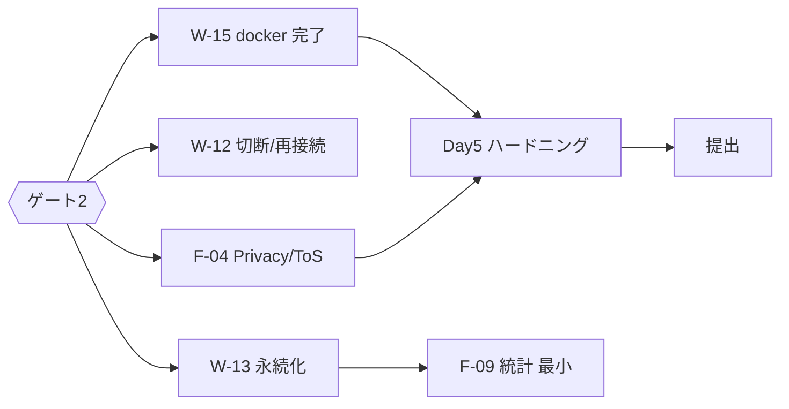

# torinoue PERT / 開発依存図（自分専用・定例投影用）

> **用途**: 4人全体の依存とクリティカルパス（IRC の `development_dependency_diagram.md` 相当）  
> **日程の正本**: [⑥ チーム分担計画 §5.1](../02_設計書/6-チーム分担計画.md)  
> **Issue 受入の正本（W/F/E/G の説明 SSOT）**: [⑤ バックログ](../02_設計書/5-バックログ.md)  
> - **W-xx** → [⑤ バックログ](../02_設計書/5-バックログ.md) §4 Backend / DevOps  
> - **F-xx** → [⑤ バックログ](../02_設計書/5-バックログ.md) §5 Frontend  
> - **E-xx** → [⑤ バックログ](../02_設計書/5-バックログ.md) §2 エンジン系（完了分は §1 にも載る）  
> - **G-xx** → [⑤ バックログ](../02_設計書/5-バックログ.md) §3 ゲームプレイ系  
> **略号の言葉**: [torinoue_用語集 §4](./torinoue_用語集.md)  
> **作成**: 2026-07-26（AI 草案 → 本人レビュー前提）
> **更新**: 2026-07-30 — W-08/W-09/W-11/W-14 main 反映。残クリティカルは auth（W-02〜W-05）と FE 合流

---

## 1. ゲート2 までの PERT（要約）

**ゴール**: 2ブラウザで 2vs2 RSP が最後まで遊べる（判定項目は [⑤ §6.1](../02_設計書/5-バックログ.md)）。

★ = 結合リスクが高い合流点。

> **2026-07-30 更新**: main に W-10（#8）・W-11（#16）・W-14（#18）・W-08（#23）・W-09（#25）が入った。
> W-12（#30）は実装済み。ロビー／ゲーム WS・再接続は **`ALLOW_DEV_AUTH` + `x-dev-user` スタブ**で先行済み。
> 残るサーバ側クリティカルは **W-02→W-03→W-04→W-05**（Cookie 本実装と Origin）。
> W-03完了後はW-13の試合永続化へ結合する。
> FE（F-03〜F-08）との「人として入る」結合がゲート2 の未完側。

---

## 2. クリティカルパス（2本）

当プロジェクトは単線ではない。**2本がゲート2 に合流**する。

| パス | 列 | 2026-07-30 時点 | 遅延時の被害 |
|---|---|---|---|
| **A. 人の入口** | W-02→W-03→**W-04**→W-05 / F-03→F-05 | **未完（torinoue）**。W-08 本体は完了だが Cookie 本線未接続 | 「ログインした人間」が本番経路でロビーに入れない |
| **B. 対戦の芯** | W-10→W-11→F-06→F-07→F-08 | **W-10/W-11 完了**。残りは F-06 以降と W-09 からの遷移 | スナップショット対戦 UI が成立しない |

⑥が当初明記した最大リスク **B の W-11 × F-06** のうち、W-11 側は解消。
いま落とすと同時多発するのは **A**（F-03/F-05 と、W-08/W-11 の認可本実装差し込み）。

```mermaid
gantt
  title ゲート2までの粗い並び（現状反映・相対日）
  dateFormat  X
  axisFormat  Day %s

  section torinoue（残）
  W-02 Fastify           :crit, a1, 0, 1d
  W-03 Prisma            :a2, after a1, 1d
  W-04 認証 ★            :crit, a3, after a2, 1d
  W-05 Origin            :a4, after a3, 1d
  W-15 docker 着手       :a5, 1, 2d

  section samatsum（サーバ）
  W-10 GameRoom ✅       :done, b1, 0, 1d
  W-11 ゲームWS ✅       :done, b2, after b1, 1d
  W-08 ロビー ✅         :done, b3, after b2, 1d
  W-09 マッチング ✅     :done, b4, after b3, 1d
  W-14 maps ✅           :done, b5, after b2, 1d

  section mamiyaza
  F-01/02                :c1, 0, 2d
  F-03 認証UI            :c2, after a3, 1d
  F-05 ロビー            :c3, after c2, 1d

  section hminemur
  F-06 準備+実装 ★       :crit, d1, 0, 3d
  F-07/08                :d2, after d1, 1d
```

※ gantt の日付は相対。絶対日程は [⑥ チーム分担計画](../02_設計書/6-チーム分担計画.md) §5.1（計画基準）。実カレンダーはサーバ側が日割りより先行している。

---

## 3. 依存行列（ブロッカー度）

| 待ち側 | 待ち先 | 内容 | 度 | 状態 |
|---|---|---|---|---|
| W-04 | W-02, W-03 | サーバ枠と DB | ★★★ | 未着手 |
| F-03, F-05 | **W-04** | Cookie ログイン | ★★★ | 待ち |
| W-08 本番認可 | **W-04** | `authenticateRequest` 本実装で stub 置換 | ★★★ | シグネチャ済み・中身待ち |
| W-09 | W-08, W-10 | マッチ成立→Room | — | ✅ main |
| F-06 | W-11✅, F-05, E-12✅ | snapshot 受信 + ロビー遷移 | ★★★ | W-11 待ち解消。F-05/実装待ち |
| F-08 | F-06, W-09✅ | マッチ遷移 | ★★☆ | W-09 待ち解消 |
| W-05 | W-04 | Origin 共通化 | ★★☆ | 未着手 |
| W-07 | W-04, W-08✅ | フレンド（切り捨て候補） | ★☆☆ | — |
| W-13 | W-11✅, W-03 | 永続化（ゲート2後でも可） | ★★☆（ゲート3） | W-03 待ち |
| W-15 | W-01✅ | 評価必須。Day5 持ち越し禁止 | ★★★（提出） | compose 本番経路未完 |

**待ち先行の一言（この表に出る主な待ち先）** — 詳細・受入は [⑤ バックログ](../02_設計書/5-バックログ.md) が正本。

| Issue | 内容（⑤より） | 状態 |
|---|---|---|
| W-02 | Fastify 本構成（pino・zod 検証・[③ REST_API設計](../02_設計書/3-REST_API設計.md) §1 エラーエンベロープ / レート制限） | 未 |
| W-03 | Prisma + SQLite スキーマ v1（③ §3 の5テーブル）+ マイグレーション | 未 |
| W-04 | 認証一式（signup/login/logout/me・argon2id・Session Cookie） | 未（`session.ts` は dev stub） |
| W-05 | Origin 検証 + Cookie 認可の共通化 | 未 |
| W-08 | ロビー WS（presence/queue/room） | ✅ #23 |
| W-09 | マッチメイキング → GameRoom / `match_found` | ✅ #25 |
| W-10 | GameRoom + `sim.wasm` 統合 | ✅ #8 |
| W-11 | ゲーム WS（join/input/snapshot 等） | ✅ #16 |
| W-14 | `GET /api/maps` + map_text 経路 | ✅ #18 |

> 例: W-04 が待つのは「サーバ枠（W-02）」と「DB（W-03）」であり、認証そのもの（W-04）ではない。

---

## 4. 並行してよい作業（待ち時間の埋め方）

| 担当 | auth 待ち中に進めてよいこと | 注 |
|---|---|---|
| samatsum | W-12（切断/再接続）・W-13 準備・レビュー | W-08〜W-11/W-14 は完了 |
| mamiyaza | F-01/F-02、認証画面の UI モック（API は後接続）、W-08 相手のモック結合 | Cookie 本線は W-04 後 |
| hminemur | W-11 実 WS 相手の F-06（dev auth 可） | 本番 Cookie 切替は後 |
| **torinoue** | **W-02/W-03 を止めない**。W-15 の調査（Dockerfile 下書き）を並行 | 最大の未完クリティカル |

---

## 5. ゲート2 判定スコープ（W-12）

| 資料 | ゲート2 に含むもの |
|---|---|
| [⑥ チーム分担計画](../02_設計書/6-チーム分担計画.md) §5.1 | Day3 終わり想定。W-12 は Day4 |
| [⑤ バックログ](../02_設計書/5-バックログ.md) ゲート表 | W-08〜W-11 / F-05〜F-08。**W-12 はゲート2 に含めず Day4** |
| Issue #5 | **CLOSED**（ゲート2 に W-12 を含めない決定） |

**確定**: ゲート2 = 「対人戦が成立すること」（⑤ §6.1）。切断/再接続（W-12）は Day4。
⑤と⑥は統一済み。食い違い提案（旧案α/β）はクローズ。

---

## 6. Day4–5（提出パス）— ゲート2 後

落とせない: コンソールゼロ、Privacy/ToS、HTTPS、空clone→compose、攻撃バッテリー、秘密情報スキャン（⑥）。  
先に落とす: 観戦 → アバター/フレンド → 統計UI厚み → FPS。

---

## 7. あなた用の早期警報

| 信号 | 行動 |
|---|---|
| 今日中に W-02 未着手 | 即着手。auth 危険を定例で宣言 |
| login が Cookie を返さない（W-04 遅延） | FE/W-08 は `ALLOW_DEV_AUTH` 継続。本線はあなたが専任 |
| F-06×W-11 が未結合 | W-11 は main 済み。hminemur のブロッカー切り分けを優先 |
| W-15 がゲート2 後も未着手 | 機能を切ってでも compose を優先（拒否条件） |
