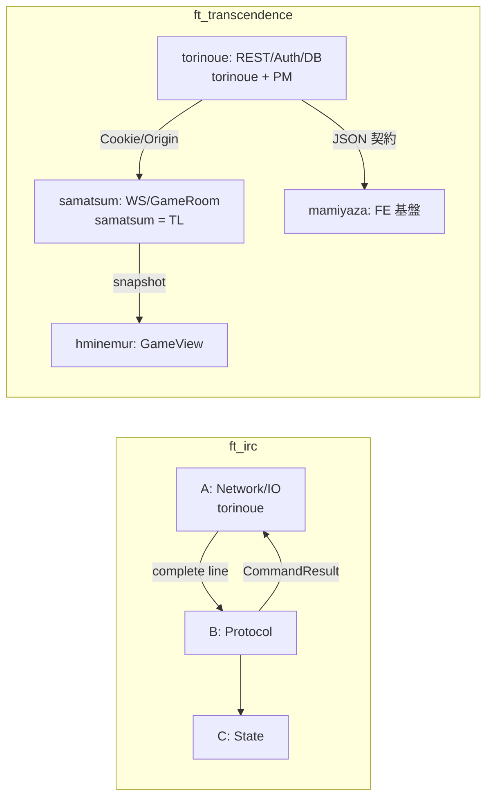

# IRC と ft_transcendence — torinoue の立ち位置比較（自分専用）

> **目的**: 成功例（IRC）での自分の型を、当プロジェクトでの役割に翻訳する  
> **IRC 参照根**: 過去課題リポジトリ（IRC）の設計・運用ドキュメント  
> **作成**: 2026-07-26（AI 草案 → 本人レビュー前提）

関連: [弱点分析](./torinoue_チーム弱点分析.md) / [読む順_実装](./torinoue_読む順_実装.md) / [読む順_PM](./torinoue_読む順_PM.md)

---

## 1. 結論（先に）

| 軸 | IRC | 当プロジェクト |
|---|---|---|
| 技術の重心 | **A層 Network/IO**（必要なら B も）が本丸 | **Auth/REST/DB/DevOps** が本丸。リアルタイム対戦の本丸は **samatsum** |
| 知識の非対称 | ソケット基盤を自分が握る側 | エンジン・WS・snapshot は **既に TL が作った遺産**を受け取る側 |
| 管理役割 | 実質 PM 的に依存・進捗 MD を量産 | **公式に PM/SM**（README / ⑥） |
| 契約文化 | `interface.md` + 図で境界を先に固定 | 設計書①〜⑤は厚いが、**稼働中の境界ペラが薄い** |
| AI | コードは手書き寄り。MD/分析は AI 全面活用を開示 | **格段に緩和**。それでも Co-Authored-By 禁止・説明責任は残る |

IRC で効いた「境界を先に合意し、自分の層を守る」型は移植可能。  
ただし **「自分がネットワーク本丸」という自己像は捨てる**。今の本丸は **セッションと REST 契約**。

---

## 2. 役割マッピング

| IRC での自分 | 近い当プロジェクトの要素 | 違う点 |
|---|---|---|
| A層の fd / poll / 送受信バッファ | Cookie セッション、Origin、docker 縁 | パケットではなく HTTP/WS 入口 |
| `interface.md` の番人 | ③ REST + `app/shared` zod の所有者 | WS 境界の最終決定権は TL |
| onboarding / reading_guide 作者 | 本 `md_files/torinoue/` 一式 | チーム公式 SSOT にするかは任意 |
| クリティカルパス分析（AI+自分） | PM としての日次ブロッカー管理 | 公式称号が付いた |

---

## 3. 責務の重さの比較

| | IRC | 当プロジェクト |
|---|---|---|
| 落とすと全体が死ぬもの | A が動かないと B/C が結合試験できない | **W-04** が無いとロビー系が人として結合できない。ただし **W-10 は先行可能** |
| 自分より知識が上の人 | 層ごとに分散 | **エンジン〜sim は samatsum が圧倒的** |
| 「契約を破るな」の対象 | 層間 API | ③ と shared。② は触らない |
| 評価での説明 | A層と設計貢献 | **PM 役割 + Auth/REST 貢献**の両方 |

IRC ではあなたが「下支えして並行を可能にする人」だった。  
今も下支えだが、**下支えの中身が TCP から Session/REST に変わった**。

---

## 4. 成功パターンで持ってきたもの / 置いてよいもの

### 持ってくる（効果大）

1. **境界オブジェクトを名前で呼ぶ**（Cookie、エラーエンベロープ、snapshot）  
2. **読む順とスキップ理由**を自分用に持つ  
3. **データフロー1枚 + 依存1枚**を定例に出す  
4. **進捗の待ちを可視化**（Issue が空でも PERT で代替）  
5. **AI は分析・草案、採否と説明は人間**（git 操作は人間）  
6. **契約変更 workflow**（設計書先行・型と受入を同変更に含める。IRC `workflow.md`）  
7. **スタブ/紙契約で待ちを切る**（auth 前に FE モック、W-10 は auth 無し先行 — 既に⑥にある型）

### 無理に持ち込まない

1. IRC 級の層別 `interface.md` 全章（時間がない。②③⑥で代替し、ギャップだけ提案）  
2. 書籍カリキュラム型オンボーディング（残り5日）  
3. A層コードの手書き至上主義を REST にそのまま適用（緩和環境を活かし、ただし説明責任は保持）  
4. quizzes / session_logs 一式（余力なし）

---

## 5. AI 利用の差（明示）

| | IRC | 当プロジェクト |
|---|---|---|
| 方針の文書化 | README / draft に段階（Navigator→分析全面→切断は手書き等） | 提出時 AI 記録が必須。開発中の制限は IRC より緩い |
| コード | 無批判コミットを避ける文化が強い | 緩和。それでも **評価で説明できるコード**が必要 |
| MD | AI 主体を開示 | 本ディレクトリも AI 草案。**コントリビュータ名義に AI を残さない**運用を本人が管理 |
| チームルール | Co-Authored-By 抑制に加え、手順書で **AI の git 操作禁止** | ⑥: **Co-Authored-By を付けない**。git は本人実行を推奨 |
| 役割の時間変化 | 初期は設計リード兼 A(+B) → 最終は A 専任 | 公式 PM + torinoue。技術最終決定は最初から TL=samatsum |

緩和は速度の味方。弱点は「理解していない生成物が境界を侵す」こと。  
所有者（あなた=REST、TL=WS）が **設計書先行**を守れれば、IRC より速く同じ安全を得られる。

---

## 6. 心理的な切り替えチェック

- [ ] 「ゲームがわからないと貢献できない」は誤り。あなたの貢献は **人が入れることとデータが残ること**  
- [ ] TL に技術決定を渡すことは敗北ではなく役割分割  
- [ ] PM は称号ではなく、Day 終わりに依存を言語化すること  
- [ ] IRC の成功体験のうち移植するのは **プロセス**であり、**担当モジュールではない**

---

## 7. 一文で言うと

> IRC では「ネットワーク層の実装者兼、境界と進捗の整備役」だった。  
> 当プロジェクトでは「認証と REST 契約の実装者兼、公式 PM」であり、  
> リアルタイム対戦の権威は TL に預けたまま、**入口と永続化と提出インフラ**で全体を支える。
