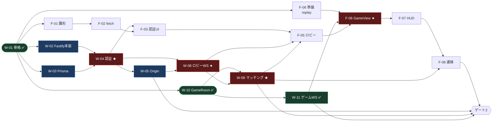
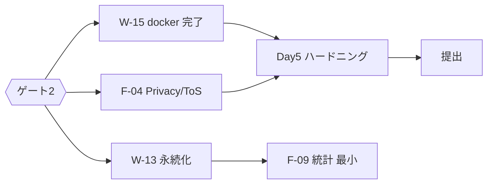

# torinoue PERT / 開発依存図（自分専用・定例投影用）

> **用途**: 4人全体の依存とクリティカルパス（IRC の `development_dependency_diagram.md` 相当）  
> **日程の正本**: [⑥ チーム分担計画 §5.1](../02_設計書/6-チーム分担計画.md)  
> **Issue 受入の正本（W/F/E/G の説明 SSOT）**: [⑤ バックログ](../02_設計書/5-バックログ.md)  
> - **W-xx** → [⑤ バックログ](../02_設計書/5-バックログ.md) §4 Backend / DevOps  
> - **F-xx** → [⑤ バックログ](../02_設計書/5-バックログ.md) §5 Frontend  
> - **E-xx** → [⑤ バックログ](../02_設計書/5-バックログ.md) §2 エンジン系（完了分は §1 にも載る）  
> - **G-xx** → [⑤ バックログ](../02_設計書/5-バックログ.md) §3 ゲームプレイ系  
> **略号の言葉**: [torinoue_用語集 §4](./torinoue_用語集.md)  
> **作成**: 2026-07-26（AI 草案 → 本人レビュー前提）

---

## 1. ゲート2 までの PERT（要約）

**ゴール**: Day3 終わりに、2ブラウザで 2vs2 RSP が最後まで遊べる。

★ = 結合リスクが高い合流点。

> **2026-07-30 更新**: W-08コア/W-09/W-10/W-11/W-12/W-14 は実装済み。現在のサーバ側合流点は W-04/W-05→W-08最終結合とW-03→W-13。

---

## 2. クリティカルパス（2本）

当プロジェクトは単線ではない。**並行する2本が Day3 に合流**する。

| パス | 列 | 遅延時の被害 |
|---|---|---|
| **A. 人の入口** | W-02→W-03→**W-04**→W-05→W-08/W-09・F-03→F-05 | 「ログインした人間」が安全にロビーから試合へ入れない |
| **B. 対戦の芯** | W-10→**W-11**→F-06→F-07→F-08 | スナップショット対戦が成立しない |

W-09〜W-11とW-08コアは完了したため、最大の残存リスクは **A の W-04/W-05→W-08最終結合 × F-05/F-08**。
B はサーバ側が着地済みで、残る合流は F-06〜F-08。

```mermaid
gantt
  title ゲート2までの粗い並び（⑥日割り準拠・相対日）
  dateFormat  X
  axisFormat  Day %s

  section torinoue
  W-02 Fastify           :a1, 0, 1d
  W-03 Prisma            :a2, after a1, 1d
  W-04 認証 ★            :crit, a3, 1, 2d
  W-05 Origin            :a4, after a3, 1d
  W-15 docker 着手       :a5, 2, 2d

  section samatsum
  W-10 GameRoom ✅        :b1, 0, 2d
  W-11 ゲームWS ✅        :b2, after b1, 1d
  W-08 ロビー ★          :crit, b3, after a4, 1d
  W-09 マッチング ★      :crit, b4, after b3, 1d

  section mamiyaza
  F-01/02                :c1, 0, 2d
  F-03 認証UI            :c2, after a3, 1d
  F-05 ロビー            :c3, after c2, 1d

  section hminemur
  F-06 準備+実装 ★       :crit, d1, 0, 3d
  F-07/08                :d2, after d1, 1d
```

※ gantt の日付は相対。絶対日程は [⑥ チーム分担計画](../02_設計書/6-チーム分担計画.md) §5.1。

---

## 3. 依存行列（ブロッカー度）

| 待ち側 | 待ち先 | 内容 | 度 |
|---|---|---|---|
| W-04 | W-02, W-03 | サーバ枠と DB | ★★★ |
| F-03, F-05 | **W-04** | Cookie ログイン | ★★★ |
| W-08 | **W-04, W-05** | Cookie認証・Origin・logout時の開いているWS失効 | ★★★ |
| W-09 | W-08, W-10 | マッチ成立→Room | ★★★ |
| F-06 | W-11, F-05, E-12✅ | snapshot 受信 + ロビー遷移 | ★★★ |
| F-08 | F-06, W-09 | マッチ遷移 | ★★☆ |
| W-05 | W-04 | Origin 共通化 | ★★☆ |
| W-07 | W-04, W-08 | フレンド（切り捨て候補） | ★☆☆ |
| W-13 | W-11, W-03, W-09 | MatchPlanと決着結果を結合して永続化（ゲート2後でも可） | ★★☆（ゲート3） |
| W-15 | W-01✅ | 評価必須。Day5 持ち越し禁止 | ★★★（提出） |

**待ち先行の一言（この表に出る主な待ち先）** — 詳細・受入は [⑤ バックログ](../02_設計書/5-バックログ.md) が正本。

| Issue | 内容（⑤より） |
|---|---|
| W-02 | Fastify 本構成（pino・zod 検証・[③ REST_API設計](../02_設計書/3-REST_API設計.md) §1 エラーエンベロープ / レート制限） |
| W-03 | Prisma + SQLite スキーマ v1（③ §3 の5テーブル）+ マイグレーション |
| W-04 | 認証一式（signup/login/logout/me・argon2id・Session Cookie） |
| W-08 | **コア実装済み・W-04/W-05結合待ち**。ロビー WS（UserContextRegistry / presence / FIFO / LobbyRoom / immutable MatchPlan）。W-09のGameRoom生成連携も完了 |
| W-10 | GameRoom + `sim.wasm` 統合 |
| W-11 | ゲーム WS（join/input/snapshot 等） |

> 例: W-04 が待つのは「サーバ枠（W-02）」と「DB（W-03）」であり、認証そのもの（W-04）ではない。

---

## 4. 並行してよい作業（待ち時間の埋め方）

| 担当 | auth 待ち中に進めてよいこと |
|---|---|
| samatsum | W-10 全部、W-11 の Room 単体試験（認可は後差し込み） |
| mamiyaza | F-01/F-02、認証画面の UI モック（API は後接続） |
| hminemur | `replay.html` / `snapshots.json` 相手の F-06 骨格 |
| **torinoue** | W-02/W-03 を止めない。W-15 の調査（Dockerfile 下書き）を並行 |

---

## 5. ゲート2 判定スコープ（確定）

ゲート2はDay3終わりに判定し、残るサーバ範囲は **W-04/W-05とのW-08最終結合**、
フロント範囲は F-05〜F-08 とする。

W-12（切断/再接続・AI代替）はゲート2に含めず、Day4の必須受入とする。
正本は [⑤ バックログ](../02_設計書/5-バックログ.md) ゲート表と
[⑥ チーム分担計画](../02_設計書/6-チーム分担計画.md) §5.1。

---

## 6. Day4–5（提出パス）— ゲート2 後

落とせない: コンソールゼロ、Privacy/ToS、HTTPS、空clone→compose、攻撃バッテリー、秘密情報スキャン（⑥）。  
先に落とす: 観戦 → アバター/フレンド → 統計UI厚み → FPS。

---

## 7. あなた用の早期警報

| 信号 | 行動 |
|---|---|
| Day1 夕時点で W-02 未完 | W-03 を同日中にスキーマだけでも置く。PM として「auth 危険」を宣言 |
| Day2 昼で login が Cookie を返さない | F-03/W-08 をモック接続に切り替えさせ、本線はあなたが専任 |
| Day3 朝に W-11×F-06 未結合 | スコープを「カスタムルーム固定」等へ縮小（TL 合意） |
| W-15 が Day4 未着手 | 機能を切ってでも compose を優先（拒否条件） |
