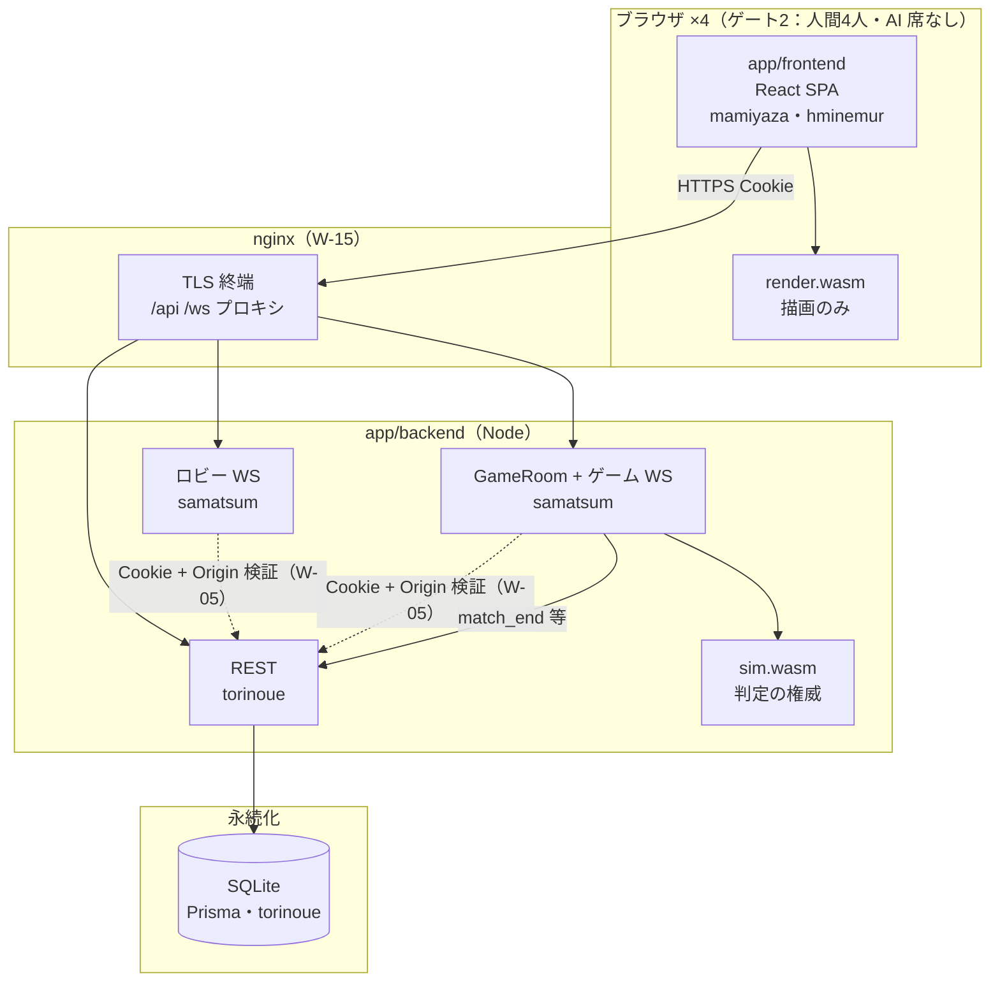
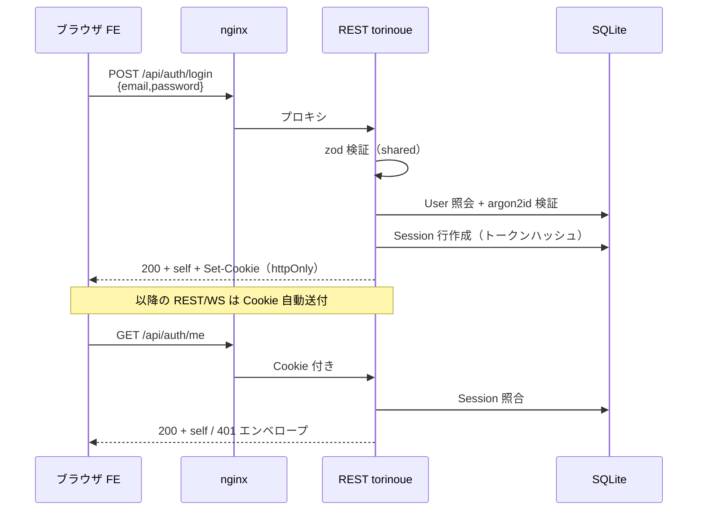
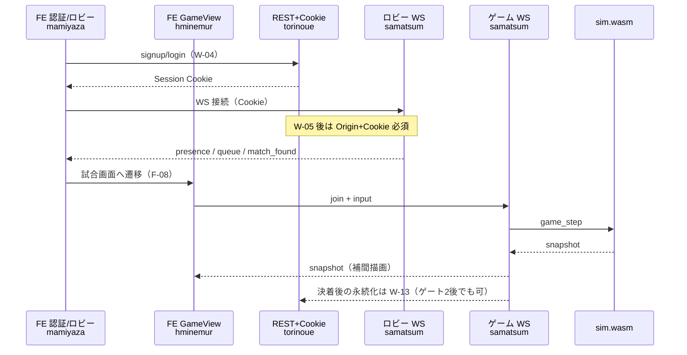
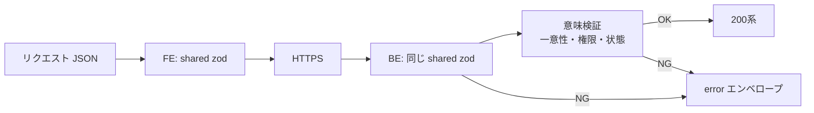
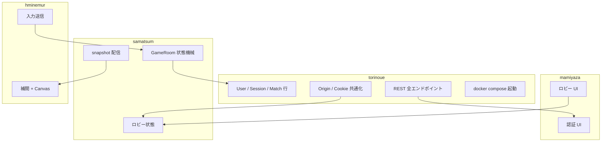

# torinoue データフロー図（torinoue 目線で作成・チーム共有可の学習資料）

> **用途**: インターフェース確認（IRC の `data_flow_diagram.md` 相当）  
> **正本ではない**: 契約の正本は [② WSプロトコル設計](../02_設計書/2-WSプロトコル設計.md)・[③ REST_API設計](../02_設計書/3-REST_API設計.md)。乖離したら設計書を直し、本図を追従させる  
> **提案付き**: 末尾に契約ギャップ  
> **作成**: 2026-07-26（AI 草案 → torinoue レビュー前提）

用語: [torinoue_用語集.md](./torinoue_用語集.md)

---

## 1. 全体配置（何がどこで動くか）



**読み方（torinoue）**: 太い責任は `REST` と `DB`。WS の中身は samatsum だが、**LOBBY・GAME 両方の WS アップグレード時に Cookie と Origin で入口を閉じる**のは torinoue（W-05）。

---

## 2. 認証の1往復（torinoue の本丸）



失敗時は常に ③ §1-A（[③ REST_API設計](../02_設計書/3-REST_API設計.md) 参照）:

```json
{ "error": { "code": "unauthenticated", "msg": "..." } }
```

実装骨格: 成功パスは未実装。404 だけ `makeError` 済み（`app/backend/src/index.ts`）。

---

## 3. ゲート2 までの「人として試合に入る」流れ



**境界オブジェクト（IRC の complete line 相当）**

| 境界 | 渡すもの | 所有者 |
|---|---|---|
| FE ↔ REST | JSON（snake_case）+ Cookie | torinoue（③ + shared） |
| FE ↔ ロビー/ゲーム WS | WS メッセージ | samatsum（②） |
| WS 入口 | Cookie 検証結果・Origin | torinoue の仕組みを samatsum が呼ぶ |
| GameRoom ↔ sim.wasm | C API（既存） | samatsum |
| GameRoom ↔ DB | 試合結果行 | torinoue（W-13） |

---

## 4. エラーと検証の二重化（要件の芯）



W-01 で「同じ zod を FE/BE が import する」型だけ示してある（`/api/health`）。  
認証以降は **スキーマを shared に足すのが契約作業そのもの**。

---

## 5. 担当レーンとデータの所有



---

## 6. 契約ギャップ（提案）

| # | 観測 | 影響 | 提案 |
|---|---|---|---|
| G1 | ③ は `shared/api/`、一部設計はルート `backend/`。実装は `app/shared/src/`・`app/backend/` | 新人と FE がパスを探す | ③ 冒頭に実装パスを明記 |
| G2 | Cookie 検証の「共通モジュール名」が設計に無い | W-05 と W-08 の結合が口頭頼み | ③ か ② に `authenticateRequest(req) → userId \| null` 相当の擬似シグネチャを1節追加 |
| G3 | health 以外の zod が未設置。`shared/ws/` も未作成 | 契約の実装 SSOT が薄い | W-02 で auth zod を `app/shared` に置く。WS 用の置き場を TL と一文決定 |
| G4 | 試合永続化がゲート2 後（W-13） | フロー図で「決着→DB」を必須と誤読しやすい | ゲート2 判定から永続化を外す旨を [⑤ バックログ](../02_設計書/5-バックログ.md) ゲート2 行に明記 |
| G5 | `.env.example` に SESSION_SECRET / ALLOWED_ORIGIN はコメントのみ | W-04/W-05 着手時に忘れやすい | W-04 PR でコメントを実キーに昇格（値は秘密にしない例示） |

設計書本文への反映は **torinoue または TL（samatsum）合意後**に行う（本ファイルは提案）。
